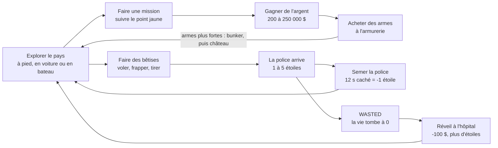

# GTAxel — Document de design

Mis à jour le 29 septembre 2026 (braquages : voiture blindée façon Mad Max, musée, bijouterie Vangelico, banque Pacific Standard ; police en force à 4 et 5 étoiles, heavy robot pilotable ; codes de triche `IDKFA`, `MISSION` + numéro, `GOKU`, Super Saiyan, et `Z6PO` ou `C3PO`, un robot doré plus lent et plus solide ; menu des langues : français, allemand, anglais et züritüütsch, enseignes comprises ; légende de la grande carte).

## Vision

GTAxel est un jeu d'action en 3D, en monde ouvert, qui se joue dans le navigateur. Il mélange GTA (ville libre, voitures, police, braquages) et Wolfenstein : on incarne B.J. Blazkowicz, qui chasse les nazis de Los Santos et de ses environs jusqu'au boss final, Hitler, dans le château Wolfenstein, sur le mont Chiliad, puis braque un musée, une bijouterie et une grande banque. Il a été imaginé par un garçon de 10 à 13 ans, qui doit pouvoir le modifier lui-même.

**Piliers de design**

- **Liberté** : dès le départ, on va où on veut, à pied ou en voiture volée. Les missions sont un fil conducteur, pas un couloir.
- **Pardonnant** : les ennemis visent mal, la vie remonte toute seule et la mort ne coûte que 100 $. On doit pouvoir faire des bêtises sans être puni trop vite. Les braquages sont l'exception voulue : ils doivent être « le plus réalistes possible », donc dangereux (vigiles qui visent bien, mitrailleuses, fumée toxique, heavy robot). Mourir y coûte toujours 100 $, et on garde le butin déjà volé.
- **Bidouillable** : tout tient dans un seul fichier `index.html`. Les réglages, les armes, les voitures, la carte, les missions et les traductions sont des tableaux commentés en français, en haut du fichier. On voit une modification en appuyant sur F5.
- **Zéro installation** : un double-clic ou un lien suffit, pourvu qu'on ait Internet. En ligne : [jlehen.github.io/GTAxel](https://jlehen.github.io/GTAxel/).

Pas de sang ni de gore : les personnages touchés tombent au sol. Pas de croix gammée non plus : les nazis se reconnaissent à leur uniforme, leur casque allemand et leur brassard rouge, et leurs bannières portent un W pour Wolfenstein.

## Boucle de jeu et contrôles

Le joueur alterne entre deux boucles. Les missions rapportent l'argent qui achète des armes ; les bêtises attirent la police jusqu'à ce qu'on la sème ou qu'on meure.

Une partie commence à pied, sans argent, avec les poings et un couteau. Le héros, B.J. Blazkowicz, a les cheveux blonds courts, un maillot blanc à manches courtes et un pantalon militaire. Il n'y a pas de fin : après la 10e mission, le pays reste libre.

### Contrôles

| Touche | À pied | En voiture |
| --- | --- | --- |
| Z Q S D ou flèches | Se déplacer | Accélérer, freiner, tourner |
| Q S D, 3 fois de suite | Danser comme Michael Jackson | Rien |
| Souris | Regarder | Tourner la caméra autour de la voiture |
| Clic gauche | Tirer ou frapper (pas en nageant) | Rien |
| Clic droit | Viser (zoom, tir plus précis ; lunette avec le fusil de sniper) | Rien |
| Maj | Courir | Rien |
| Espace | Sauter (environ 1 m), rien en nageant | Frein à main, virage plus serré |
| Ctrl ou C | S'accroupir (bascule) | Rien |
| E ou F | Monter en voiture ou en bateau, acheter une arme ou le masque à gaz, prendre l'ascenseur, parler au garagiste, voler le butin, poser la perceuse ou l'explosif, éjecter le pilote du heavy robot ou monter dedans | Descendre (pas en plein looping) |
| V | 1re ou 3e personne | Vue intérieure ou extérieure |
| 1 à 8, molette | Changer d'arme | Rien |
| M | Ouvrir ou fermer la grande carte | Ouvrir ou fermer la grande carte |
| Entrée | Taper un code de triche | Taper un code de triche |
| Échap | Pause | Pause |

Les touches sont repérées par leur position : Z Q S D sur un clavier AZERTY, W A S D sur un QWERTY. Seule la touche M suit la lettre imprimée sur le clavier.

**Dans le heavy robot** : Z Q S D le font marcher (4 m/s, 6 m/s avec Maj), la souris le tourne et vise, le clic gauche tire à la mitrailleuse lourde, le clic droit lance une roquette, E fait descendre, V passe de la vue derrière l'épaule à la vue dans la cabine. On ne peut ni sauter, ni s'accroupir, ni changer d'arme, ni danser.

### Déplacements

| Allure | Vitesse |
| --- | --- |
| Course (Maj) | 8 m/s |
| Marche | 4 m/s |
| En visant | 2,4 m/s |
| Accroupi | 2 m/s |
| Nage (Maj) | 4 m/s |
| Nage | 2,2 m/s |
| Moonwalk (pendant la danse) | 1,5 m/s, à reculons |

Le code de triche `Z6PO` multiplie toutes ces vitesses par 0,6.

- Une marche de 60 cm au plus se monte sans sauter (`PASMAX`) : escaliers, trottoirs, lits, conteneurs empilés... Le terrain, lui, se monte à pied quelle que soit la pente.
- **Nage** : là où l'eau est trop profonde pour avoir pied (plus de 1,30 m), B.J. nage, couché à la surface. Il ne peut ni tirer, ni sauter, ni s'accroupir, et son arme est rangée. En nageant, il remonte sur une plage ou un ponton (marche de 1,90 m au plus). On ne se noie pas.

### La danse

Taper gauche, arrière, droite trois fois de suite (Q S D Q S D Q S D, ou A S D sur un clavier QWERTY) fait danser B.J. comme Michael Jackson. Il faut 9 touches sans aucune autre au milieu ; il n'y a pas de temps limite. Les touches sont dans le réglage `touchesDanse`.

La danse dure 6 s, en trois pas. Leurs durées sont dans le réglage `moonwalk` (3, 1 et 2 s).

| Pas | Durée | Ce que fait B.J. |
| --- | --- | --- |
| Moonwalk | 3 s | Il se met de profil et recule d'environ 4,4 m, à 1,5 m/s (`vitesseMoonwalk`). Ses jambes marchent vers l'avant, le pied qui avance glisse sur la pointe. La tête baissée, le coude en avant, il tient le bord de son chapeau de la main droite ; son bras gauche bouge à peine. « Moonwalk ! » s'affiche |
| Toupie | 1 s | Il fait 2 tours et quart sur la pointe des pieds, vite puis de moins en moins, la main droite toujours au chapeau, le bras gauche serré contre lui et un genou plié. Il pousse son petit cri : « hi-hiii ! » |
| Pose | 2 s | Face à la caméra, d'un coup sec, le geste de Michael Jackson : la main droite entre les jambes, le bras gauche tendu sur le côté, les genoux pliés et écartés, sur la pointe des pieds, le bassin en avant, la tête baissée sous le chapeau. « WHO'S BAD ? » s'affiche |

- La danse passe en 3e personne, pour qu'on la voie. Les angles sont pris par rapport à la caméra au moment où la danse commence ; ensuite, la souris tourne autour de B.J. sans le déranger.
- **Le chapeau** : un chapeau noir à ruban clair, rabattu sur les yeux. B.J. le porte du début à la fin de la danse, et seulement pour danser.
- B.J. range son arme pour danser. Le moonwalk s'arrête contre un mur comme une marche normale.
- Appuyer sur une touche pour bouger, sauter ou s'accroupir, tirer ou viser arrête la danse tout de suite. Monter en voiture, tomber à l'eau ou mourir aussi. La dernière touche de la suite, si elle reste enfoncée, ne l'arrête pas.
- On ne danse qu'à pied : en voiture, en bateau ou en nageant, la suite de touches ne fait rien.
- Comme ce sont les touches pour se déplacer, B.J. fait quelques pas de côté et en arrière avant de danser.

### Caméras

- **3e personne (par défaut)** : caméra 3,8 m derrière l'épaule droite. En visant, elle se rapproche à 1,8 m et le champ de vision passe de 70° à 45°. Elle avance quand un mur la gêne.
- **1re personne (V)** : l'arme est dessinée par-dessus la scène, avec balancement et recul.
- **Lunette du fusil de sniper** : en visant, le champ de vision passe à 14° (70° divisé par le `zoom` de l'arme, qui vaut 5). L'écran devient noir autour d'un rond, avec deux traits noirs en croix. La souris est 5 fois plus douce, pour viser finement. L'arme en 1re personne n'est plus dessinée. En 3e personne, la caméra reste derrière l'épaule, et le noir cache B.J.
- **En voiture** : caméra 8 m derrière une voiture classique, 11 m derrière une limousine, 6 m derrière un tricycle. Elle recule avec la vitesse et se recale seule après 1,5 s sans bouger la souris. En vue intérieure (V), les yeux sont à la place du conducteur.
- **Mort** : vue plongeante sur le corps pendant 3,5 s.
- La caméra ne passe ni sous le terrain ni sous l'eau.

## Le monde

Le pays est une île inspirée de celle de GTA 5, en plus petit et plus simple : Los Santos au sud, avec son aéroport et son port, les collines de Vinewood, le désert de Grand Senora et Sandy Shores au bord de l'Alamo Sea, puis le mont Chiliad et Paleto Bay au nord. Il mesure environ 3,6 km d'ouest en est et 5,2 km du nord au sud. Il faut à peu près 3 minutes en voiture classique pour le traverser du sud au nord.

Tout est construit au chargement à partir du tableau `CARTE` de `index.html` : 70 lignes de 48 signes, le nord en haut. Chaque signe est une case de 74 m. Une lettre est un pâté de maisons de 60 m, entouré de rues de 14 m. Les autres signes sont du terrain, sans rues. Le pays est le même à chaque partie.

La carte compte 314 pâtés, dont 155 d'immeubles, 55 de maisons, 25 de tours et 23 de docks. Il y a aussi 63 cases de piste d'aéroport, 135 cases de route et 1 523 cases d'eau.

### Les signes de la carte

| Signe | Contenu |
| --- | --- |
| `T` | Une grande tour de 20 à 45 étages, ou 4 tours de 12 à 29 étages, en verre ou modernes |
| `I` | 2 ou 4 immeubles de 3 à 10 étages, en brique, béton ou modernes |
| `M` | 4 maisons avec pelouse et arbres, 1 voiture garée |
| `P` | Pelouse, allées pavées, fontaine, jusqu'à 14 arbres, 1 trousse de soin |
| `.` `X` `a`–`z` | Place pavée avec 4 arbres et 2 voitures garées. `X` est le départ, les minuscules sont les lieux de mission |
| `A` `H` `C` `S` `G` `K` `Z` `E` `L` `O` `R` `J` `F` `D` `N` `B` `W` | Pâtés où l'on peut entrer (tableau plus bas) |
| `U` `V` `Q` | Pâtés à braquer, où l'on entre aussi : musée, bijouterie, grande banque (voir « Braquages ») |
| `~` | Eau : mer, lac ou rivière |
| `_` | Plage de sable |
| `,` | Herbe, avec des arbres par-ci par-là |
| `;` | Champs, en bandes jaunes et vertes |
| `:` | Désert, avec des cactus |
| `*` | Forêt de sapins |
| `1` à `9` | Colline ou montagne : 30 m par chiffre (`hauteurMontagnes`), donc 270 m pour un `9` |
| `=` | Route de campagne |
| `#` | Pont : une route qui passe sur l'eau |
| `+` | Pont en ville : les rues autour de cette case d'eau passent dessus |
| `&` | Ponton en planches, avec un hors-bord et un jet-ski amarrés |
| `!` | Piste d'aéroport, parfois avec un avion posé dessus |

### Le relief et l'eau

- **Hauteur du terrain** : chaque case a une hauteur (tableau `ALTITUDE` : –9 m pour l'eau, 0,3 m pour la plage, 1,5 m pour l'herbe, 3 m pour le désert, 4 m pour la forêt, 30 m par chiffre). Le terrain passe en douceur d'une case à l'autre, avec des bosses en plus (jusqu'à 1,2 m, plus en montagne). Une route prend la hauteur moyenne des cases autour d'elle.
- **Villes à plat** : les pâtés qui se touchent (même en diagonale) forment une ville, toute à la même hauteur : celle du terrain le plus bas autour d'elle, jamais sous 0 m. Los Santos, Sandy Shores et Paleto Bay sont au bord de l'eau, donc à 0 m. La maison de Franklin, dans les collines, est à 30 m ; le château Wolfenstein, sur le mont Chiliad, à 150 m. Autour d'une ville et de ses rues, le terrain reste plat sur 4 m, puis rejoint le reste en 40 m.
- **Eau** : un grand plan à 1 m sous les rues (`EAU`), qui ondule et reflète le ciel. Là où le terrain passe dessous, il y a de l'eau. Les bords de l'eau sont sablés.
- **Couleurs** : herbe, forêt, champs, désert ou sable selon la case, mélangées d'une case à l'autre. La roche grise (ou rousse dans le désert) apparaît sur les pentes raides et au-dessus de 260 m.
- **Végétation** : 12 sapins par case de forêt, 5 en montagne (2 au-dessus de 7), 2 arbres par case d'herbe, 1 cactus par case de désert, 2 palmiers par case de plage à Los Santos, et des rochers dans les montagnes.

### Les villes

| Ville | Où | Ce qu'on y trouve |
| --- | --- | --- |
| Los Santos | Sud | Vinewood et son musée d'art, le centre (tours, gratte-ciel Maze Bank, banque, grande banque Pacific Standard, commissariat), la bijouterie Vangelico, Vespucci et sa plage, la villa de Michael, l'hôpital, l'armurerie, LS Customs, le fleuve et ses deux ponts, l'aéroport et ses hangars, le port avec ses conteneurs et ses grues |
| Paleto Bay | Nord | Maisons, supérette, hôpital, armurerie, station-service, garage LS Customs |
| Grapeseed | Nord-est | Deux fermes et une supérette au milieu des champs |
| Sandy Shores | Au sud de l'Alamo Sea | Caravane de Trevor, bar Yellow Jack, supérette, hôpital, commissariat, armurerie, aérodrome |
| Harmony | Désert | Station-service et supérette |
| Chumash | Côte ouest | Maisons et supérette |
| Fort Zancudo | Côte ouest | Le bunker nazi, une caserne, un hangar et une piste |
| Mont Chiliad | Nord | Le château Wolfenstein, au bout d'une route de montagne |

Deux stations-service isolées bordent les grandes routes, et la maison de Franklin domine Los Santos dans les collines de Vinewood.

### Les routes

- **En ville**, les rues longent chaque pâté, avec trottoirs de 20 cm, lampadaires tous les 18 m et passages piétons à chaque carrefour. Une rue qui traverse l'eau (`+`) est un pont avec des garde-fous.
- **À la campagne**, les cases `=` et `#` qui se touchent (même en diagonale) forment des routes de 10 m de large, arrondies dans les virages. Le bout d'une route se branche sur le coin de pâté le plus proche, dans son prolongement. Les grandes routes :
  - la **Great Ocean Highway**, qui longe la côte ouest de Los Santos à Paleto Bay, avec deux ponts ;
  - la **Senora Freeway**, qui monte de Los Santos à Sandy Shores, puis à Grapeseed et Paleto Bay par la côte nord ;
  - la **Route 68**, qui traverse le pays d'ouest en est, par Harmony ;
  - la route des collines de Vinewood, de Los Santos à la Route 68 ;
  - la route du château, qui grimpe de Grapeseed au sommet du Chiliad.
- Une route monte et descend en douceur : sa hauteur est lissée le long de son tracé, et le terrain est creusé ou remblayé sur 7 m de chaque côté, puis rejoint le reste en 13 m. La route du château reste raide : environ 30 %.
- **Ponts** : une route au-dessus de l'eau reste au moins 3,5 m au-dessus de la surface, pour que les bateaux passent dessous. Le tablier fait 1,2 m d'épaisseur, avec deux rambardes et un pilier tous les 3 points de la route. Les rambardes ne retiennent pas : on peut tomber à l'eau.
- **Pontons** : une jetée de planches de 36 m part de la plage vers le large, 50 cm au-dessus de l'eau. Il y en a 5 : Vespucci, Paleto Bay, Sandy Shores (sur l'Alamo Sea), le port de Los Santos et Chumash.

### Les pistes de cascades

Deux pistes pour faire le fou en voiture, inspirées du jeu *Stunts* (1990). Elles sont décrites dans le tableau `CASCADES` : une case de départ, une direction, puis des morceaux posés bout à bout. Une piste fait 9 m de large, en goudron avec des bordures rouges et blanches. Toute la piste est à une seule hauteur, celle du terrain en moyenne ; le terrain est mis à plat dessous sur 7,5 m de chaque côté du milieu, puis rejoint le reste en 15 m. Il n'y pousse ni arbre ni rocher. Une voiture attend à côté du départ.

| Piste | Où | Départ | Morceaux, dans l'ordre | Voiture |
| --- | --- | --- | --- | --- |
| Stunt Park de Palomino | À l'est de Los Santos, au sud du réservoir | Colonne 32, ligne 49, vers l'est | Tremplin (2,5 m, trou de 16 m), looping, 4 bosses, virage relevé de 180°, tire-bouchon, pont de 5 m, tremplin (3 m, trou de 22 m) | Porsche |
| Sauts de Grand Senora | Dans le désert, à l'est de Harmony | Colonne 27, ligne 30, vers l'est | Tremplins de 3 et 4 m (trous de 25 et 35 m), pont de 6 m, tremplin de 5 m (trou de 45 m) | Classique |

| Morceau | Forme | Réglages (et leur valeur si on n'en met pas) |
| --- | --- | --- |
| `droit` | Une ligne droite, par terre | `longueur` (30 m) |
| `virage` | Un arc de cercle. Relevé, il penche vers l'intérieur : le bord extérieur monte à 4,5 m pour 30°. Il se relève sur le premier quart et redevient plat sur le dernier | `sens` (`'gauche'` ou `'droite'`), `angle` (90°), `rayon` (25 m), `releve` (0°) |
| `tremplin` | Une rampe à 30 % jusqu'à la hauteur, un trou, puis une rampe à 20 % pour retomber. Avec `saut: 0`, la rampe s'arrête dans le vide | `hauteur` (3 m), `saut` (20 m) |
| `looping` | Un cercle debout. La sortie est décalée de 11 m à droite de l'entrée | `rayon` (9 m) |
| `tire-bouchon` | La piste fait un tour complet sur elle-même en avançant : au milieu, à deux rayons de haut, on roule la tête en bas | `longueur` (40 m), `rayon` (5 m) |
| `pont` | Une rampe à 25 %, un pont sur des piliers, une rampe pour redescendre | `hauteur` (5 m), `longueur` (30 m) |
| `bosses` | Des bosses de 10 m de long, qui font décoller à grande vitesse | `nombre` (4), `hauteur` (1,2 m) |

- **Rampes pleines** : les rampes, les bosses et les virages relevés sont en béton jusqu'au sol. On bute contre leurs côtés et contre le bout d'un tremplin, on ne passe pas au travers. Là où le bord est à plus de 1 m du sol, deux rambardes retiennent la voiture. Sous un pont, on passe entre les piliers.
- **Vitesse** : le premier tremplin de Palomino se saute entre 60 et 80 km/h environ ; plus vite, on dépasse la rampe d'arrivée et on retombe par terre. Le looping demande au moins 76 km/h en bas, le tire-bouchon environ 60 km/h (voir « Conduite »).
- Sur la mini-carte et la grande carte, les pistes sont des traits orange, et un rond « C » orange marque leur départ, avec leur nom.

### Les bâtiments où l'on entre

Un bâtiment visitable a des murs de 30 cm, une porte, un sol, des lampes au plafond et des meubles. Ceux qui ont des étages ont un escalier au fond à gauche : une volée par étage, qui va à droite puis revient à gauche, avec un trou dans le plancher au-dessus.

| Lettre | Bâtiment | Étages visitables | Ce qu'il y a dedans |
| --- | --- | --- | --- |
| `A` | Armurerie | Rez-de-chaussée | Comptoir, armes au mur, les 5 stands d'armes, le stand du masque à gaz, 1 gilet pare-balles |
| `H` | Hôpital | Hall (4 étages pleins au-dessus) | Accueil, chaises, lits, 2 trousses de soin. On se réveille devant la porte |
| `C` | Commissariat | 2 étages et le toit | Accueil, bancs, 3 cellules à barreaux ; bureaux et 1 gilet en haut ; 2 voitures de police garées devant |
| `S` | Supérette 24/7 | Rez-de-chaussée | Rayons, frigos, caisse, 1 trousse de soin, 1 voiture garée |
| `G` | Garage LS Customs | Un grand atelier de 5,5 m de haut | Pont élévateur, pneus, établi, 1 voiture, le garagiste (combinaison bleue, casquette rouge) qui blinde les voitures. On y entre en voiture par une porte de 11 m |
| `K` | Banque | Hall de 5 m de haut | Colonnes, guichets, coffre-fort ouvert avec des lingots et 2 000 $ (voir « Argent ») |
| `Z` | Gratte-ciel Maze Bank | Hall, et le toit à 141 m | Accueil, ascenseur jusqu'au toit, hélistation, antenne, garde-fou |
| `E` | Station-service | Petite boutique | Rayon, frigos, caisse, 1 trousse de soin ; pompes sous un auvent |
| `L` | Maison de Franklin | 2 étages et le toit | Salon (canapé, télé), cuisine, chambre en haut, 1 voiture |
| `O` | Villa de Michael | 2 étages et le toit | Comme chez Franklin, en plus grand ; piscine (on ne nage pas dedans), palmiers, une Porsche |
| `R` | Caravane de Trevor | Une pièce | Lit, table, cartons ; dehors, un vieux canapé, des fûts et un 4x4 |
| `J` | Bar Yellow Jack | Rez-de-chaussée | Bar, bouteilles, tabourets, billard, tables, 1 tricycle devant |
| `F` | Ferme | Grange et grenier | Bottes de paille ; silo dehors ; 1 4x4 |
| `D` | Docks | Entrepôt (une fois sur deux) | Conteneurs dedans et dehors, empilés jusqu'à 3 ; ou un parc à conteneurs avec une grue à portique |
| `N` | Hangar d'avions | Un hangar de 10 m de haut | Un avion ; porte de 32 m |
| `B` | Bunker nazi | Le bunker, par l'ouest | Voir ci-dessous |
| `W` | Château Wolfenstein | Le donjon : 4 étages de 4 m et le toit crénelé | Trône, grande table ; 2 trousses de soin (au 2e étage et sur le toit) |
| `U` | Musée d'art de Los Santos | Une grande salle de 6 m de haut | Portique à 6 colonnes et fronton, sol en marbre, le grand tableau derrière un cordon rouge, la couronne, 2 vitrines de bijoux, 2 statues, 4 autres tableaux, des bancs ; 4 vigiles et 2 chiens |
| `V` | Bijouterie Vangelico | Une boutique de 3,6 m de haut | Façade noire et or, murs en bois, 8 vitrines de bijoux, le gros diamant sur une colonne noire ; 1 vigile devant la porte |
| `Q` | Banque Pacific Standard | Un hall de 6 m de haut (4 étages pleins au-dessus) | Portique à piliers, guichets, colonnes de marbre ; au fond, le couloir des lasers, la porte ronde du coffre-fort, la grille et le pactole ; 3 vigiles |

- **Bunker** (`B`) : enceinte de 4 m avec une seule entrée à l'ouest, sacs de sable. Le bunker lui-même s'ouvre aussi à l'ouest : dedans, le Kommandant, 2 soldats, des caisses, une table et un fusil d'assaut. Dehors, 6 soldats, 2 trousses de soin et 1 gilet.
- **Château** (`W`) : remparts crénelés de 7 m avec une grande porte au sud, 4 tours à toit pointu, bannières rouges. Hitler et 8 soldats gardent la cour. Dans la cour aussi : 2 trousses, 1 mitraillette, 1 gilet.
- Les autres bâtiments (tours, immeubles, maisons) sont pleins : on ne peut pas y entrer.

Un étage fait 3 m, sauf mention contraire. Les trousses de soin et les gilets pare-balles réapparaissent 60 s après avoir été ramassés.

### Le ciel et la vue

- Ciel réaliste avec des nuages qui avancent lentement, un soleil fixe et des ombres autour du joueur.
- Le brouillard commence à 180 m et cache tout au-delà de 900 m (`distanceVue`). Le pays est découpé en morceaux de 8 × 8 cases : seuls ceux qui ne sont pas cachés par le brouillard sont dessinés.
- Les vitres des immeubles reflètent le ciel ; les murs, les pavés et les tuiles ont du relief.
- Tout autour de l'île, la mer s'étend jusqu'à l'horizon. On ne peut pas s'éloigner à plus de 30 m du bord de la carte.

### La population

Seuls les environs du joueur sont vivants. Piétons et voitures apparaissent hors de sa vue et disparaissent quand il s'éloigne.

| | Piétons | Voitures en circulation |
| --- | --- | --- |
| Nombre | 30 | 16 |
| Apparaissent entre | 45 et 170 m | 60 et 230 m |
| Disparaissent au-delà de | 200 m | 280 m |
| Vitesse | 1,4 m/s | 11 m/s (40 km/h) |

- **Piétons** : ils ne vivent qu'en ville. Ils vont de coin en coin sur les trottoirs et traversent aux passages piétons (30 % de chances à chaque coin). Ils s'enfuient pendant 8 s si on tire à moins de 40 m ou si on les frappe. Ils n'ont pas tous la même taille (10 % de moins à 6 % de plus que B.J.), ni la même carrure. 4 sur 10 ont les cheveux longs, la moitié des manches courtes, 1 sur 4 un short.
- **Voitures** : elles roulent sur la voie de droite, en ville comme sur les routes de campagne, et choisissent leur direction à chaque carrefour (60 % tout droit). Dans un cul-de-sac, elles font demi-tour. Elles s'arrêtent devant un obstacle, et font demi-tour après 5 s bloquées. Le type de chaque voiture est tiré au sort (voir « Véhicules »).
- **Voitures garées** : il y en a devant les maisons, les places, les magasins et dans les garages, prêtes à être volées. Leur type est tiré au sort de la même façon, sauf chez Michael (une Porsche), Franklin (une classique), Trevor (un 4x4), à la ferme (un 4x4), au Yellow Jack (un tricycle) et au commissariat (2 voitures de police).
- Personne d'autre que B.J. ne va dans l'eau profonde : les piétons et les ennemis font demi-tour au bord.

## Combat et armes

Il y a 8 armes, dont 2 au départ (poings et couteau). Le pistolet, la mitraillette, le fusil à pompe et le fusil d'assaut s'achètent à l'armurerie ou se ramassent sur les ennemis. Le fusil de sniper s'achète seulement à l'armurerie : aucun ennemi ne le lâche. Le bazooka ne s'achète pas : c'est Hitler qui le lâche. Un tir à la tête fait 2,5 fois plus de dégâts.

### Les armes

| Arme | Dégâts par coup | Coups par seconde | Portée | Prix | Munitions achetées | Particularité |
| --- | --- | --- | --- | --- | --- | --- |
| Poings | 15 | 2,2 | 2 m | départ | illimitées | Repousse la cible de 50 cm |
| Couteau | 50 | 2 | 2,3 m | départ | illimitées | Repousse la cible de 50 cm |
| Pistolet | 40 | 3,3 | 90 m | 200 $ | 36 | Un clic par tir |
| Mitraillette | 22 | 12,5 | 60 m | 800 $ | 150 | Automatique, peu précise |
| Fusil à pompe | 8 plombs × 20 | 1,1 | 30 m | 1 200 $ | 30 | Très dispersé |
| Fusil d'assaut | 34 | 8,3 | 130 m | 2 000 $ | 120 | Automatique, précis |
| Bazooka | 250 au centre | 0,67 | 150 m | lâché par Hitler | 10 roquettes | Explose dans un rayon de 6 m |
| Fusil de sniper | 150 | 0,67 | 250 m | 2 500 $ | 20 | Un clic par tir, lunette qui grossit 5 fois |

- Racheter une arme déjà possédée coûte moitié prix et ne donne que des munitions.
- Une arme ramassée donne la moitié des munitions ; si on l'a déjà, le quart.
- Les coups de poing et de couteau touchent l'ennemi le plus proche devant soi, jusqu'à 50° de côté.
- La dispersion est divisée par 2 en visant et doublée en courant.
- Renverser quelqu'un avec une voiture à plus de 14 km/h fait 200 dégâts.
- **Fusil de sniper** : une balle suffit pour un piéton, un policier ou un soldat. Il en faut 3 pour le Kommandant (2 à la tête) et 6 pour Hitler (3 à la tête). Dans la lunette, la balle s'écarte d'au plus 13 cm à 200 m ; sans viser, d'au plus 37 cm à 50 m. Un nazi touché de loin est alerté, mais il ne tire que s'il voit B.J. à moins de 45 m : on peut l'abattre sans risque, par l'entrée du bunker ou la porte du château.
- **Bazooka** : la roquette part du canon vers le viseur et vole tout droit à 20 m/s (`vitesseRoquette`), plus vite que B.J. qui court (8 m/s). Elle explose sur le premier mur ou voiture qu'elle touche, si elle passe à moins de 1 m du milieu du corps d'un personnage, par terre si on vise le sol, ou au bout de 150 m. Les dégâts baissent avec la distance à l'explosion, jusqu'à 0 à 6 m ; il n'y a pas de bonus à la tête. L'explosion blesse aussi B.J. s'il est trop près (jusqu'à 40 points s'il est collé) et fait exploser les voitures à moins de 6 m. Un personnage tué par une explosion compte comme s'il avait été abattu : un piéton ou un policier donne une étoile.

### Les personnages

| Type | Vie | Arme | Coups de pistolet pour tuer | Ce qu'il lâche |
| --- | --- | --- | --- | --- |
| Piéton | 50 | aucune | 2 | 10 à 69 $ (6 fois sur 10) |
| Policier | 70 | pistolet | 2 | Un pistolet |
| Soldat nazi | 90 | fusil d'assaut | 3 | Une mitraillette ou un fusil d'assaut |
| Kommandant | 450 | fusil à pompe | 12 (5 à la tête) | Un fusil à pompe et 1 000 $ |
| Hitler (boss final) | 900 | bazooka | 23 (9 à la tête) | Le bazooka et 2 000 $ |
| Vigile (braquages) | 100 | pistolet, fusil à pompe, mitraillette ou fusil d'assaut | 3 | Son arme |
| Chien de garde | 45 | ses crocs | 2 | Rien |
| Policier d'élite (4 étoiles) | 140 | fusil d'assaut | 4 | Un fusil d'assaut |

Les corps disparaissent au bout de 15 s. Le chien est un berger allemand, fauve au dos noir, oreilles dressées ; mort, il tombe sur le côté. Le policier d'élite porte un casque, une tenue noire et un gilet pare-balles.

Un personnage a un visage (yeux, sourcils, bouche, nez, oreilles), des coudes et des genoux. Ses genoux se plient quand il marche, quand il s'accroupit et quand il s'assoit sur un tricycle. Plus il va vite, plus ses coudes sont pliés et plus il se penche en avant.

### Le joueur

- **Vie** : 100 points. Elle remonte de 8 points par seconde après 5 s sans être touché, soit de 0 à 100 en 12,5 s. Une trousse de soin rend 50 points.
- **Masque à gaz** : il s'achète 500 $ à l'armurerie (`prixMasque`), une fois pour toutes. B.J. le met tout seul dans la fumée toxique de la bijouterie, qui ne lui fait alors plus rien. On le voit sur son visage : du caoutchouc noir, deux hublots, une cartouche filtrante.
- **Gilet pare-balles** : 100 points de protection (`giletMax`), qui prennent les dégâts à la place de la vie. Il ne se recharge pas tout seul : il faut ramasser un autre gilet. Il y en a 7 : dans les 3 armureries, au premier étage des 2 commissariats, dans le bunker (près de l'entrée) et dans le château (près de la porte). Quand B.J. en porte un, on le voit sur son torse, en bleu foncé.
- **Quand il est touché** : l'écran rougit sur les bords et un son grave retentit.

### Les ennemis

Un ennemi ne tire que s'il voit le joueur : ligne de vue dégagée, à moins de 70 m pour un policier et 45 m pour un soldat ou un vigile. Il tire toutes les 1 à 2 s, 0,6 à 1,2 s pour le Kommandant et 1,5 à 3 s pour Hitler. Les vigiles et les policiers d'élite armés d'une mitraillette ou d'un fusil d'assaut tirent en rafales : 3 à 5 balles à 0,13 s d'écart, puis une pause de 1,2 à 2 s. Il avance si le joueur est à plus de 22 m et recule s'il est à moins de 6 m.

| Ennemi | Dégâts par balle |
| --- | --- |
| Policier | 5 |
| Soldat | 7 |
| Kommandant | 12 |
| Hitler | 35 par roquette, au centre de l'explosion |
| Vigile | 9, le double au fusil à pompe à moins de 15 m (`degatsGarde`) |
| Policier d'élite | 9 (`degatsElite`) |
| Chien de garde | 12 par morsure, toutes les 0,9 s (`degatsChien`) |
| Heavy robot | 10 par balle de mitrailleuse, 40 par roquette (`degatsRobot`, `degatsRoquetteRobot`) |
| Mitrailleuses de la banque | 5 par balle (`degatsMitrailleuse`) |

Avec le code de triche `Z6PO`, les balles font moitié moins mal (2,5 pour un policier), même celles des mitrailleuses de la banque et du heavy robot ; pas les roquettes ni les morsures de chien.

La chance de toucher vaut 35 % à courte distance (`precisionEnnemis`) et baisse avec l'éloignement : environ 25 % à 25 m et 7 % au-delà de 50 m. Les vigiles, les policiers d'élite et le heavy robot visent mieux : 50 % de près (`precisionPros`) ; les mitrailleuses de la banque, 30 %. Elle est divisée par 2 si on est accroupi, et multipliée par 0,6 si on court. En voiture, elle est multipliée par 0,7 et on ne prend que 40 % des dégâts ; dans une voiture blindée, rien ne passe ; dans le heavy robot, on ne prend que 30 % des dégâts (`protectionRobot`).

Hitler tire au bazooka. Sa roquette vole comme celle du joueur : il vise B.J. là où il est au moment du tir (il ne prévoit pas où il va). Elle explose si elle passe à moins de 1 m de lui, sur un mur ou une voiture, ou par terre. Elle laisse une traînée de fumée grise, qui aide à la voir venir. À 20 m, elle met 1 s à arriver : en courant sur le côté dès qu'on voit la flamme, on l'esquive. Une roquette ratée vise le sol à 3 à 6 m de B.J. et peut encore le blesser (rayon de 5 m). Elle explose aussi sur les soldats, policiers ou passants qui se trouvent sur son chemin, et les blesse comme le bazooka de B.J. (jusqu'à 250) : on peut se cacher derrière eux. Un piéton ou un policier tué par Hitler ne donne pas d'étoile à B.J. Hitler n'est jamais blessé par sa propre roquette. Elle fait exploser la voiture de B.J. s'il est dedans.

**Temps de survie estimé, sans bouger ni se soigner** :

| Situation | Temps moyen avant de mourir |
| --- | --- |
| 1 policier à 10 m | environ 85 s |
| Le Kommandant à 10 m | environ 20 s |
| Hitler à 10 m, sans bouger | environ 16 s |
| Les 8 soldats à 20 m qui voient le joueur | environ 10 s |

Avec un gilet pare-balles, ces temps doublent à peu près. Contre Hitler, on tient bien plus longtemps en esquivant ses roquettes. Ce sont des calculs à partir des réglages, pas des mesures en jeu.

Les nazis (soldats, Kommandant et Hitler) ne quittent jamais l'enceinte du bunker ou du château. Ils attaquent quand ils voient le joueur, ou quand il tire à moins de 50 m.

## Police et recherche

Le niveau de recherche va de 0 à 5 étoiles. Chaque bêtise ajoute une étoile ; 12 s sans être vu par la police en retirent une. À 0 étoile, les policiers sont pacifiques.

### Ce qui donne une étoile

- Tuer un piéton, à l'arme ou en l'écrasant.
- Tuer un policier.
- Frapper un policier, ou tirer à moins de 30 m de lui, quand on n'a encore aucune étoile.
- Voler une voiture de police, ou n'importe quelle voiture sous les yeux de la police.
- Braquer la banque : prendre les 2 000 $ du coffre donne 3 étoiles d'un coup.
- Déclencher l'alarme d'un braquage : on monte d'un coup à 4 étoiles (musée, bijouterie) ou 5 (banque Pacific Standard).
- Tuer un vigile.

### La réponse de la police

| Étoiles | Policiers au plus (à pied et en route) | Voitures de police en route, au plus | En plus | Temps minimum pour tout perdre |
| --- | --- | --- | --- | --- |
| 1 | 2 | 0 | | 12 s |
| 2 | 6 | 1 | | 24 s |
| 3 | 10 | 2 | | 36 s |
| 4 | 16 | 4 | Une voiture sur deux est un fourgon blindé, avec 4 policiers d'élite | 48 s |
| 5 | 22 | 5 | Le heavy robot | 60 s |

Ces nombres sont dans les réglages `policiers` et `voituresPolice`. Les policiers qui arrivent en voiture comptent déjà (2 par voiture, 4 par fourgon) : la police ne dépasse pas le nombre du tableau.

- **À pied** : un renfort apparaît toutes les 4 s, hors de vue, entre 45 et 170 m, au coin d'un pâté : il n'y en a pas en pleine campagne.
- **En voiture** : dès 2 étoiles, une voiture de police apparaît toutes les 6 s entre 90 et 230 m. Elle roule à 65 km/h, sur les rues comme sur les routes de campagne, et prend à chaque carrefour le chemin le plus court jusqu'au joueur (recalculé chaque seconde). À moins de 30 m, elle s'arrête et 2 policiers en descendent.
- **Fourgons blindés** : dès 4 étoiles (`etoilesBlindes`), une voiture sur deux est un fourgon blindé. Il roule à 122 km/h (`vitesseBlindes`) : il rattrape une voiture classique, pas une Porsche. Les balles ne lui font rien, il tient 3 roquettes. Arrivé, il débarque 4 policiers d'élite, qui tirent en rafales.
- **Après une alarme de braquage**, pendant une minute, les renforts à pied et en voiture arrivent 3 fois plus vite (toutes les 1,3 s et toutes les 2 s).
- **Être vu** : un policier vivant à moins de 50 m avec une ligne de vue dégagée, ou une voiture de police conduite à moins de 50 m. Les étoiles clignotent en bleu tant que la police voit le joueur.
- **Fin de poursuite** : à 0 étoile, les renforts à plus de 50 m disparaissent. Mourir remet aussi les étoiles à 0.

La sirène s'entend à moins de 180 m d'une voiture de police en route, et les policiers apparaissent en points rouges et bleus sur la mini-carte.

### Le heavy robot

À 5 étoiles (`etoilesRobot`), la police envoie un heavy robot, comme dans *Wolfenstein : The New Order*. Il arrive 15 s après la 5e étoile, hors de vue, entre 70 et 170 m ; il n'y en a qu'un à la fois, et le suivant arrive 15 s après qu'on s'en est débarrassé. Quand on perd toutes ses étoiles, il repart s'il est à plus de 50 m.

- **Le robot** : 4,7 m de haut, gris-bleu acier, sur deux grosses jambes avec des vérins. Son torse est une caisse blindée, avec « POLICE » sur le ventre, deux gyrophares, deux phares et deux pots d'échappement. Devant, derrière une vitre blindée, un policier est assis aux commandes. Au bras gauche, une mitrailleuse à 6 canons qui tournent ; au bras droit, un lance-roquettes à 4 tubes.
- **Il marche** à 4 m/s (`vitesseRobot`), droit sur B.J. quand il le voit (à moins de 110 m), sinon par les rues, en suivant le chemin des voitures de police. Chaque pas fait un bruit sourd, et fait trembler la caméra quand il est à moins de 40 m. Il bute contre les murs et les voitures, ne passe pas sous les portes et ne va pas dans plus de 2 m d'eau.
- **Il tire** quand il voit B.J. et lui fait face : des rafales de 10 énormes balles (un gros trait jaune), à 0,12 s d'écart, puis une pause de 1,5 à 2,5 s ; et une roquette toutes les 5 à 8 s, comme celles d'Hitler (rayon 5 m). Ses balles cabossent la voiture où se trouve B.J.
- **Le vaincre** : son blindage arrête tout (les balles ricochent), sauf la vitre de la cabine. Elle tient 350 points (`vitreRobot`) : 9 balles de pistolet, 11 de fusil d'assaut, ou 2 roquettes. Une fois la vitre en éclats, on peut abattre le pilote (70 points, tête × 2,5 ; une explosion le blesse aussi), ou s'approcher à moins de 3,8 m et appuyer sur E pour l'éjecter : il tombe à côté et attaque. Sans pilote, le robot s'agenouille.
- **Le piloter** : E à côté d'un robot sans pilote fait monter B.J. dans la cabine (on le voit assis, derrière la vitre cassée). La mitrailleuse lourde fait 45 dégâts par balle, 11 balles par seconde, et porte à 150 m ; les roquettes font 250 dégâts (rayon 6 m), une toutes les 1,2 s. Il a 500 balles et 12 roquettes (tableau `ARMES_ROBOT`). Dedans, on ne prend que 30 % des dégâts. En mourant, B.J. est éjecté.
- Sur la mini-carte, le robot est un gros point qui clignote en rouge et bleu, gris quand personne ne le pilote.

## Véhicules

Tous les véhicules se volent, garés ou en circulation, police comprise. Il suffit d'appuyer sur E à moins de 1,30 m du bout du véhicule (3,50 m de son milieu pour une voiture classique), et à peu près à la même hauteur que lui. Si quelqu'un conduit, il est éjecté : un civil s'enfuit, un policier attaque.

### Les types de véhicules

Il y a 6 types de voitures, la voiture et le fourgon blindé de la police, et 2 bateaux. Ils sont décrits dans le tableau `VOITURES`, en haut de `index.html`.

| Type | Vitesse maximale | 0 à 100 km/h | Virage | Chance | Taille (long. × larg. × haut.) | Couleurs | Signes particuliers |
| --- | --- | --- | --- | --- | --- | --- | --- |
| Classique | 115 km/h (32 m/s) | 2,0 s | 1 | 6 | 4,4 × 1,8 × 1,45 m | les 10 | Berline à 4 portes, pare-chocs chromés |
| Porsche | 180 km/h (50 m/s) | 1,3 s | 1,2 | 2 | 4,3 × 1,9 × 1,28 m | rouge, jaune, gris, noir, bleu | Basse, phares ronds, aileron, 2 pots d'échappement |
| Minibus | 90 km/h (25 m/s) | jamais | 0,8 | 3 | 5 × 1,95 × 2,1 m | 5 couleurs vives | Haut couleur crème, phares ronds, 4 vitres de chaque côté |
| 4x4 du désert | 108 km/h (30 m/s) | 1,7 s | 0,9 | 2 | 4,8 × 2,05 × 2 m | sable, kaki | Grosses roues, pare-buffle, galerie avec jerricans, roue de secours, 4 projecteurs |
| Limousine | 101 km/h (28 m/s) | 2,7 s | 0,6 | 1 | 7,4 × 1,85 × 1,45 m | noir, blanc | Très longue, 4 vitres de chaque côté, baguettes chromées |
| Tricycle | 72 km/h (20 m/s) | jamais | 1,4 | 1 | 2,5 × 1,3 × 1,25 m | les 10 | Moto à 3 roues : on voit le pilote, et rien ne le protège |
| Voiture de police | 115 km/h (32 m/s) | 2,0 s | 1 | 0 | 4,4 × 1,8 × 1,45 m | blanc | Classique avec bande bleue et gyrophares |
| Fourgon blindé | 137 km/h (38 m/s) | 2,3 s (calculé) | 0,8 | 0 | 5,8 × 2,3 × 2,55 m | noir | Caisse d'acier, petites vitres, grosses roues, pare-buffle, marchepieds, « POLICE » sur les flancs, gyrophares, projecteurs. Blindé : les balles ricochent, il tient 3 roquettes |
| Hors-bord | 108 km/h (30 m/s) | pas mesuré | 0,8 | 0 | 5,5 × 2,1 × 1,4 m | blanc, rouge, bleu, noir | Coque en V, pare-brise, moteur à l'arrière ; on voit le pilote |
| Jet-ski | 86 km/h (24 m/s) | pas mesuré | 1,5 | 0 | 3 × 1,15 × 1,1 m | jaune, bleu, rouge, vert | Petite coque, selle, guidon ; on voit le pilote |

- **Chance** : sur 15 véhicules tirés au sort, il y a en moyenne 6 classiques, 3 minibus, 2 Porsche, 2 4x4, 1 limousine et 1 tricycle. La voiture et le fourgon de police ne sont jamais tirés au sort : ils n'arrivent que quand on est recherché.
- **Virage** : 1 = comme la classique. Le tricycle tourne sec, la limousine très large.
- Les vitesses et les temps du tableau ont été mesurés en ligne droite, pied au plancher.
- En circulation, tout le monde roule à 40 km/h.
- **Bateaux** (`bateau: true`) : on ne les croise pas en circulation, ils attendent aux pontons. Ils flottent, n'avancent que là où il y a au moins 50 cm d'eau, et s'arrêtent net contre la plage, un ponton ou un pilier de pont. Leur nez se lève quand ils foncent. Comme sur le tricycle, rien ne protège le pilote. En descendant au large, on nage.

### Conduite

| Caractéristique | Valeur |
| --- | --- |
| Marche arrière | 36 km/h |
| Freinage | 2,5 fois plus fort que l'accélération |

- La direction ne répond pas à l'arrêt. Elle est la plus vive vers 20 km/h, puis deux fois moins à pleine vitesse.
- Les roues avant braquent quand on tourne. La carrosserie pique du nez au freinage, se cabre à l'accélération et penche dans les virages (4° au plus).
- Le frein à main (Espace) freine fort et serre le virage.
- Contre un mur ou une autre voiture, au-dessus de 22 km/h, il y a un bruit de choc et la voiture perd 65 % de sa vitesse. Au-dessus de 11 km/h (vers le mur), elle s'abîme (voir « Dégâts »).
- En descendant, le joueur sort du côté qui n'est pas contre un mur. La voiture continue sur son élan puis s'arrête.
- **Pentes** : la voiture suit le sol et penche avec lui, en avant et sur le côté. La pente la freine en montée et la pousse en descente (`graviteVoiture`, 9,8 m/s², × le sinus de la pente) : une classique monte la route du château sans peine.
- **Sauts** : la voiture tombe avec la vraie gravité (9,8 m/s², `graviteVoiture`). Elle décolle quand le sol descend plus vite qu'elle ne tombe : au bout d'un tremplin, en haut d'une bosse ou d'une côte prise vite, un peu en montant sur un trottoir. Au bout d'un tremplin, elle garde tout l'élan de la rampe, même quand ses roues avant sont déjà dans le vide. En l'air, ni gaz, ni frein, ni volant, et son nez suit peu à peu la trajectoire. Un saut de moins de 30 cm ne compte pas : les amortisseurs le prennent, et on garde la main.
- **Retomber** : elle rebondit un peu (20 % de la vitesse du choc, au-dessus de 3 m/s). Au-dessus de 7 m/s (une chute de 2,5 m sur du plat), elle s'abîme : ses roues se tordent, et l'avant ou l'arrière se cabosse si elle retombe sur le nez ou sur l'arrière (penchée de plus de 17° par rapport au sol). Retomber sur une rampe dans le sens de la pente ne fait presque rien. Après plus de 0,8 s en l'air, « SAUT ! » annonce la longueur du saut.
- **Loopings et tire-bouchons** : la voiture y roule comme sur des rails, sur son élan : ni moteur, ni frein, ni volant, et la pente la ralentit en montant. Elle reste plaquée tant que (vitesse² × courbure) + (9,8 × la part de la piste tournée vers le haut) reste positif. En haut d'un looping de 9 m, il faut 9,4 m/s, donc au moins 76 km/h en bas ; en haut du tire-bouchon, 9,2 m/s, soit environ 60 km/h en bas. Sinon, elle tombe (« Pas assez d'élan ! ») comme elle est, souvent sur le toit : le toit s'écrase, les vitres éclatent, puis elle se remet d'un coup sur ses roues. Trop lente avant d'être à la verticale, elle redescend en arrière. À la sortie, « LOOPING ! » ou « TIRE-BOUCHON ! » s'affiche. On y entre par un bout ou par l'autre, en avant ou en marche arrière. En vue intérieure (V), la caméra tourne avec la voiture.
- **Dans l'eau** : à plus de 40 cm d'eau, la voiture freine fort. À plus de 1,10 m, elle coule : B.J. en sort à la nage, et on ne peut plus y remonter. Elle disparaît au bout de 25 s, quand le joueur est à plus de 60 m.

### Protection

En voiture, le joueur ne prend que 40 % des dégâts, et les ennemis le touchent 30 % moins souvent. En contrepartie, on ne peut pas tirer depuis une voiture.

Le tricycle, le hors-bord et le jet-ski n'ont pas de carrosserie : ils ne protègent pas. On y prend les mêmes dégâts qu'à pied, et on ne peut pas tirer non plus.

### La voiture blindée façon Mad Max

Le garagiste de LS Customs blinde les voitures rapides, celles qui vont à au moins 144 km/h (`vitesseBlindable`, 40 m/s) : parmi les voitures du jeu, seule la Porsche. On gare la voiture dans le garage, on descend, et on appuie sur E devant le garagiste : il prend 5 000 $ (`prixBlindage`), des étincelles jaillissent de la soudure, et la voiture est blindée. S'il n'y a pas de voiture dans le garage, si elle n'est pas assez rapide, déjà blindée, ou s'il manque de l'argent, il le dit.

- **Ce qui se voit** : des plaques d'acier rouillé soudées sur les flancs (un peu de travers, avec des rivets et des soudures), sur le capot, le toit et l'arrière ; des barreaux sur le pare-brise et la vitre arrière, deux barres sur les vitres de côté ; un pare-chocs en acier à 5 pointes ; deux pots d'échappement tout droits derrière.
- **Ce que ça fait** : les balles ricochent (« piou ») sans rien abîmer ; les chocs l'abîment 3 fois moins ; elle encaisse 3 roquettes (`roquettesBlindage`), qui la cabossent, et explose à la 4e. Un message dit combien de roquettes elle peut encore prendre. Tant qu'elle tient, rien n'atteint B.J. à l'intérieur : ni balle, ni explosion.
- **Ce que ça coûte** : elle est plus lourde et garde 92 % de sa vitesse et de son accélération (`lourdeurBlindage`) : une Porsche blindée monte à 166 km/h.
- Le garage la répare comme les autres, sans enlever le blindage. Le fourgon blindé de la police, s'il est volé, protège de la même façon.

### Dégâts

Une voiture a cinq côtés, qui s'abîment de 0 (neuve) à 1 (épave) : l'avant, l'arrière, la gauche, la droite et le toit. Les bateaux ne s'abîment pas. Le réglage `degatsVoitures` multiplie tous les dégâts (0 = jamais).

| Ce qui arrive | Dégâts, du côté touché |
| --- | --- |
| Choc contre un mur, un pilier, une voiture | (vitesse vers l'obstacle − 3 m/s) × 0,03 : 0,2 à 36 km/h, 0,5 à 72 km/h, 0,8 à 108 km/h. Frotter un mur en biais abîme peu. L'autre voiture prend autant, de son côté |
| Retomber à plus de 7 m/s | (vitesse − 7) × 0,05 à l'avant ou à l'arrière si elle tombe sur le nez ou l'arrière ; la moitié aux roues |
| Retomber sur le toit | 0,3 + 0,03 par m/s au toit |
| Une balle | Dégâts de l'arme ÷ 2 000 (0,02 au pistolet), un petit creux de 3 cm, et la vitre la plus proche (à moins de 80 cm) se fêle, puis se brise. Rien sur une voiture blindée |
| Une roquette | Tout casse, et la voiture explose (voir plus bas) |

Ce qui se voit :

- **Tôle** : la carrosserie s'enfonce autour du choc, sur 0,5 à 1,2 m, de 60 % de la force en mètres (40 cm au plus d'un coup, 45 cm en tout), et elle se froisse. Chaque choc fait sa bosse : une voiture peut être cabossée à plusieurs endroits.
- **Vitres** : un choc de plus de 0,08 près d'une vitre la fêle (des fissures blanches) ; une vitre déjà fêlée, ou un choc de plus de 0,3, la brise : elle tombe en éclats. Un côté abîmé à plus de 0,7 brise toutes ses vitres, et un toit à plus de 0,4 les brise toutes.
- **Pièces qui partent** : les pare-chocs et leur plaque (avant ou arrière, à partir de 0,45 à 0,65), les rétroviseurs (sur le côté, 0,25 à 0,45), l'aileron de la Porsche, et sur le 4x4 le pare-buffle, la roue de secours et la galerie du toit. Elles volent, rebondissent, puis restent 30 s par terre.
- **Phares** : ils s'éteignent quand l'avant passe 0,35 ; les feux arrière, quand l'arrière passe 0,35.
- **Roues** : un choc à moins de 1,5 m d'une roue la tord : elle part de travers (jusqu'à 11°), penche et se dandine en tournant. Des roues avant tordues tirent la voiture d'un côté : il faut tenir le volant. Une chute trop dure tord les quatre.
- **Moteur** : quand l'avant est abîmé, la vitesse maximale baisse (−45 % pour une épave). Au-dessus de 0,5, le moteur fume gris ; au-dessus de 0,8, noir.
- **Réparer** : entrer en voiture dans un garage LS Customs la répare, gratuitement (« Voiture réparée ! »).
- Une voiture n'explose jamais à force de chocs : on peut rouler avec une épave.

### Explosions

Une voiture explose quand une roquette explose à côté d'elle (6 m pour celle du joueur, 5 m pour celle d'Hitler ou du heavy robot). Les balles ne lui font rien. Une voiture blindée encaisse 3 explosions avant d'exploser à la 4e.

- L'explosion fait jusqu'à 150 dégâts aux personnages à moins de 7 m, et jusqu'à 40 à B.J. (`degatsExplosion`).
- Les voitures à moins de 7 m explosent à leur tour : on peut faire sauter toute une file.
- Si B.J. est dedans, il est éjecté avant l'explosion.
- Toutes ses vitres volent en éclats, ses pièces partent en l'air et sa tôle s'enfonce des quatre côtés.
- Il reste une carcasse noire, qui brûle 12 s. On ne peut plus monter dedans. Elle disparaît au bout de 40 s, quand le joueur est à plus de 60 m.

### Ce que les voitures ne font pas (encore)

Les balles les cabossent et cassent leurs vitres, mais ne les font pas exploser. Elles ne font pas de tonneaux et ne dérapent pas. Les portes ne s'ouvrent pas. On ne voit personne dans les voitures fermées : seul le pilote d'un tricycle est visible. Il n'y a pas de klaxon, et les feux arrière ne s'allument pas plus fort au freinage.

## Missions et progression

Les 10 missions s'enchaînent dans l'ordre et rapportent 428 200 $ au total. Les 6 premières emmènent le joueur de la livraison d'un colis au combat final contre Hitler (18 200 $). L'argent gagné avant le bunker (3 000 $ une fois le pistolet payé) suffit pour s'offrir le fusil d'assaut ou le fusil de sniper, mais pas les deux. Les 4 suivantes sont les braquages : d'abord la voiture blindée pour s'enfuir, puis le musée, la bijouterie et la grande banque (voir « Braquages »).

| # | Mission | Étapes | Récompense |
| --- | --- | --- | --- |
| 1 | Le colis | Aller au point `a`, puis au point `b` dans le centre de Los Santos | 500 $ |
| 2 | Armé jusqu'aux dents | Acheter un pistolet à l'armurerie | 200 $ |
| 3 | Voleur de voitures | Amener une voiture dans un garage LS Customs (`G`, le plus proche) | 1 000 $ |
| 4 | Course-poursuite | Monter à 3 étoiles, puis semer la police | 1 500 $ |
| 5 | Opération bunker | Aller au point `d`, à Fort Zancudo, puis éliminer le Kommandant dans le bunker | 5 000 $ |
| 6 | Le château Wolfenstein | Éliminer Hitler dans le château, sur le mont Chiliad | 10 000 $ |
| 7 | Mad Max | Amener une voiture rapide (une Porsche) au garage LS Customs, puis payer le garagiste pour la blinder (5 000 $) | rien |
| 8 | Le musée d'art | Garer la voiture blindée devant le musée (`U`), voler le grand tableau, les 2 vitrines de bijoux, la couronne et les 2 statues, puis semer la police et rapporter le butin à la planque (la caravane de Trevor, `R`), dans la voiture blindée | 60 000 $ |
| 9 | La bijouterie Vangelico | Garer la voiture blindée devant la bijouterie (`V`), voler le gros diamant, puis semer la police et le rapporter à la planque | 100 000 $ |
| 10 | Le casse de la Pacific Standard | Garer la voiture blindée devant la banque (`Q`), passer les lasers, percer le coffre-fort, faire sauter la grille, prendre le pactole, puis semer la police et le rapporter à la planque | 250 000 $ |

Les premières missions restent dans Los Santos. Le bunker est à environ 2,5 km du garage, par la Great Ocean Highway ; le château est tout au nord. La planque des braquages, la caravane de Trevor à Sandy Shores, est à environ 2 km des trois bâtiments.

Pour tester une mission sans refaire les précédentes, le code de triche `MISSION` suivi d'un numéro y saute directement (voir « Codes de triche »).

Après la dernière mission, l'objectif affiche « Pays libre : fais ce que tu veux ! ».

### Types d'étapes

Une mission est une liste d'étapes. Chaque étape est validée dès que sa condition est vraie :

| Type | Condition |
| --- | --- |
| `aller` | Être à moins de 4 m du lieu. Un lieu est une lettre de la carte : s'il y en a plusieurs (un garage `G`), c'est la plus proche qui compte |
| `voiture` | Être en voiture à moins de 7 m du lieu. On peut exiger `rapide: true` (une voiture qui va à au moins `vitesseBlindable`), `blindee: true` (une voiture blindée) et `sansPolice: true` (0 étoile). Devant un pâté à braquer, le lieu est l'endroit où se garer, sur la place devant l'entrée |
| `eliminer` | Plus aucun personnage de ce type en vie (`soldat`, `boss` ou `hitler`) |
| `etoiles` | Avoir au moins ce nombre d'étoiles |
| `semer` | Revenir à 0 étoile |
| `arme` | Posséder l'arme nommée |
| `blindage` | Avoir une voiture blindée par le garagiste |
| `voler` | Tout le butin du pâté (lettre `lieu`) est dans le sac |

### Guidage

- Un point jaune sur la mini-carte montre l'objectif. Il reste collé au bord quand l'objectif est loin.
- Dans le monde, une colonne jaune lumineuse de 5 m marque le lieu, ou une flèche jaune flotte au-dessus de la cible à éliminer ou du butin à voler. Pendant un braquage, elle montre le plus proche de ce qu'on peut prendre ou actionner tout de suite (la perceuse, puis l'explosif, puis le pactole), et le garagiste pour la mission Mad Max.
- Le texte de l'étape s'affiche en bas de l'écran. À la fin, un bandeau annonce « MISSION RÉUSSIE » et la récompense.

### Argent

| Source | Montant |
| --- | --- |
| Missions | 200 à 250 000 $ |
| Hitler | 2 000 $ |
| Le Kommandant | 1 000 $ |
| Piétons tués | 10 à 69 $, 6 fois sur 10 |
| Coffre de la banque | 2 000 $ et 3 étoiles ; il se remplit de nouveau au bout de 5 minutes |
| Mort | -100 $ |
| Blindage chez le garagiste | -5 000 $ |
| Masque à gaz | -500 $ |

### Mort

Quand la vie tombe à 0, l'écran passe en noir et blanc avec « WASTED » pendant 3,5 s. Le joueur se réveille devant l'hôpital le plus proche (il y en a 3 : Los Santos, Sandy Shores, Paleto Bay) avec toute sa vie, 100 $ de moins et 0 étoile. Il garde ses armes, ses munitions, son masque, le butin déjà dans son sac et sa progression dans les missions. S'il pilotait le heavy robot, il en est éjecté.

## Braquages

Trois bâtiments de Los Santos se braquent : le musée d'art (`U`), la bijouterie Vangelico (`V`) et la banque Pacific Standard (`Q`). Chacun a son alarme, ses gardes et son butin. On peut y entrer à toute heure : tant qu'on ne vole rien, qu'on ne tire pas et qu'on ne sort pas d'arme devant un vigile, rien ne se passe. Ils sont faits pour être réalistes et dangereux ; les missions 8 à 10 les enchaînent (voir « Missions »).

### Le butin

- On vole avec E, à moins de 2 m de l'objet. Un objet sous vitrine fait voler la vitre en éclats. Tout va dans le sac, qu'on voit sur le dos de B.J. ; on peut continuer à tirer.
- Le butin n'a pas de prix à l'objet : c'est la récompense de la mission qui le paie, quand on arrive à la planque (la caravane de Trevor) dans la voiture blindée, avec 0 étoile. Le sac se vide alors.
- Le butin volé ne revient pas. Mourir ne fait pas perdre le butin déjà dans le sac.

| Bâtiment | Butin |
| --- | --- |
| Musée d'art | Le grand tableau, une « Nuit étoilée » de 4,2 × 2,6 m (on découpe la toile, le cadre doré reste) ; la couronne en or à 8 pointes, sertie de rubis et de saphirs, sur un coussin de velours ; le collier de rubis ; les bagues en diamant ; la statue grecque en marbre, grandeur nature ; le chat égyptien en or |
| Bijouterie Vangelico | Le gros diamant, taillé en brillant, qui tourne et scintille sous sa cloche de verre |
| Banque Pacific Standard | Le pactole : deux palettes de liasses de billets, avec des lingots d'or dessus |

### L'alarme

L'alarme se déclenche quand on vole un objet, quand on pose la perceuse, quand on touche un laser, quand on blesse un vigile ou un chien, quand on tire à moins de 50 m de l'un d'eux, ou quand un vigile ou un chien voit B.J. à moins de 15 m avec une arme à feu à la main (pas en voiture).

- Les étoiles montent d'un coup : 4 pour le musée et la bijouterie, 5 pour la banque. Pendant une minute, les renforts de police arrivent 3 fois plus vite.
- Tous les vigiles et les chiens du bâtiment attaquent.
- On l'entend jusqu'à 250 m : une sonnerie à deux notes, hachée 16 fois par seconde. Les gyrophares du bâtiment (sur la façade et au plafond) clignotent en rouge, et une lumière rouge clignote dedans.
- Elle s'arrête quand on a semé la police (0 étoile) ou qu'on est mort ; les vigiles se calment.

### Les vigiles et les chiens

- **Les vigiles** (chemise grise, pantalon et casquette noirs) restent dans leur pâté. Ils ont chacun leur arme, pistolet, fusil à pompe, mitraillette ou fusil d'assaut, et visent bien (voir « Les ennemis »). Musée : 4 vigiles (dont un sur la place), banque : 3, bijouterie : 1 devant la porte.
- **Les chiens** (2 au musée) restent aussi dans leur pâté. En alerte, ils courent à 9 m/s, plus vite que B.J., et mordent (12 points toutes les 0,9 s). Ils ne mordent pas à travers une carrosserie : autour d'une voiture ou du robot, ils aboient.

### La bijouterie : la fumée toxique

Quand l'alarme sonne, des bouches au plafond lâchent une fumée verdâtre qui remplit la boutique en 5 s. Dedans, sans masque à gaz, B.J. tousse et perd jusqu'à 12 points de vie par seconde (`degatsFumee`) : le gilet ne protège pas. L'écran se voile de vert. Avec le masque à gaz (armurerie, 500 $), la fumée ne fait plus rien et le voile est léger. La fumée se dissipe en 15 s après l'alarme.

### La banque : lasers, mitrailleuses, coffre-fort

- **Le couloir des lasers** : derrière le hall, un couloir de 3,6 m de large et 11 m de long mène au coffre. 7 lasers rouges le barrent : 4 en travers (dont un à 35 cm du sol, à sauter, un à 1,35 m, à passer accroupi, et deux qui montent et descendent) et 3 debout, qui balaient le couloir de gauche à droite. Il faut passer entre eux, au bon moment.
- **Les mitrailleuses** : si B.J. touche un laser, l'alarme sonne et 3 mitrailleuses automatiques descendent du plafond (deux dans le couloir, une dans la salle du coffre). Elles suivent B.J. et tirent pendant 5 s (`dureeMitrailleuses`), 5 balles par seconde chacune, s'il est en vue. Debout, sans gilet, deux mitrailleuses font perdre environ 75 points en 5 s (on peut en mourir, avec un peu de malchance) ; accroupi, deux fois moins. On peut les détruire : 60 points chacune.
- **La perceuse thermique** : devant la porte ronde du coffre-fort (3,2 m, en acier, avec son volant à trois branches et ses 16 boulons), E pose une perceuse jaune sur son pied magnétique. Elle perce pendant 40 s (`dureePerceuse`), avec des étincelles et un bruit strident ; l'aide affiche le pourcentage. L'alarme sonne tout de suite : il faut tenir. Puis la porte pivote sur ses gonds en 3 s.
- **L'explosif** : derrière la porte, une grille de barreaux ferme la salle du coffre. E colle un pain de plastic avec son détonateur ; la diode clignote et bipe, de plus en plus vite, pendant 5 s (`dureeCharge`). L'explosion (rayon 5 m, jusqu'à 70 points pour B.J.) fait voler les 4 panneaux de la grille. Il faut s'éloigner !
- **Le pactole** est alors au fond, entre les murs de coffres de location.

## Codes de triche

Il y a deux sortes de codes de triche : ceux qui changent l'apparence de B.J. (un « effet »), et ceux qui font une action tout de suite, pour tester le jeu. Parmi les codes d'apparence, seul `Z6PO` change aussi le jeu. Entrée ouvre une case « Code : » ; on tape le code, puis Entrée. Pendant la saisie, les touches ne font plus bouger le joueur. Entrée ne fait rien quand la grande carte est ouverte. Un mauvais code affiche « Code inconnu ». Les chiffres se tapent avec ou sans Maj : sur un clavier français, la touche 6 donne « 6 » et non « - », et la touche 8 donne « 8 » et non « _ ».

| Code | Effet |
| --- | --- |
| `SLIP` | En slip : jambes nues, slip blanc |
| `CHAUSSURE` | Perd la chaussure gauche (il reste la chaussette blanche) |
| `SOUTIF` | Torse et bras nus, soutien-gorge rose |
| `JAMBEDEBOIS` | Jambe droite en bois, sans chaussure |
| `BARCA` | Maillot du Barça à rayures bleues et grenat |
| `BEBE` | Deux fois plus petit, avec une grosse tête, tout nu avec une couche blanche |
| `GOKU` | San Goku en Super Saiyan : kimono orange déchiré en haut, l'épaule droite nue, t-shirt bleu qui dépasse au col et à la manche gauche, ceinture, bracelets et bottes bleus. Ses cheveux dorés se dressent en 13 pics, et une aura dorée l'entoure, avec des flammes qui montent |
| `Z6PO` ou `C3PO` | Z6PO, le robot doré : tout en or, la tête chauve avec deux yeux orange qui brillent et une bouche en fente, des fils gris à la taille, le bas de la jambe droite en argent. Il bouge comme un robot, va 0,6 fois moins vite, et les balles lui font moitié moins mal |
| `IDKFA` | Comme dans *Doom* : toutes les armes (bazooka compris), au moins 3 fois leurs munitions, le gilet pare-balles plein et le masque à gaz |
| `MISSION` suivi d'un numéro | Saute à cette mission, à sa première étape (`MISSION8` : le musée ; `MISSION11` : pays libre). Le sac est vidé. Si la mission a besoin d'une voiture blindée et qu'il n'y en a pas, une Porsche blindée apparaît à 5 m de B.J. |

**Z6PO** (`C3PO` est un autre nom pour le même code : taper l'un annule l'autre) :

- **Il bouge comme un robot** : sa pose ne change que 8 fois par pas, par à-coups. Il fait de petits pas, les genoux presque raides, les coudes pliés et les bras un peu écartés, qui bougent à peine. Il ne se penche pas pour courir, mais se dandine d'un pied sur l'autre. Il se tourne par crans d'environ 11°.
- **Plus lent** : toutes ses allures sont multipliées par 0,6 (`vitesse`) : 2,4 m/s en marchant, 4,8 m/s en courant, et même la nage et le moonwalk. En voiture ou dans le heavy robot, rien ne change.
- **Plus solide** : les balles lui font moitié moins mal (`balles`) : celles des policiers, des soldats, du Kommandant, des vigiles, des policiers d'élite, des mitrailleuses de la banque et de la mitrailleuse du heavy robot. Les roquettes, les explosions et les morsures de chien, non.

Les codes à action se retapent autant qu'on veut ; un nombre tapé juste après le code lui est donné (`MISSION8`). Retaper un code d'apparence annule son effet. Les effets se combinent : B.J. est remis dans sa tenue normale, puis chaque code actif est appliqué dans l'ordre du tableau (Z6PO passe donc tout en or, même le kimono de Goku, mais ce que Goku ajoute reste : les pics de cheveux, les bracelets, le haut des bottes et l'aura). Ils durent même après une mort, mais pas après un rechargement de la page. À part Z6PO, les codes d'apparence ne changent rien au jeu : la caméra reste à hauteur d'adulte pour le bébé, et l'arme vue en 1re personne ne change pas. Les codes sont dans le tableau `TRICHES`, en haut de `index.html`.

Dans ce tableau, un code a un `texte` (l'annonce) et un `effet` (ce qu'il change sur B.J.) ou une `action` (ce qu'il fait tout de suite). Il peut avoir un `alias` (un autre nom), une `vitesse` et des `balles` (des nombres qui multiplient ses allures et les dégâts des balles ; s'il y a plusieurs codes actifs, ils se multiplient entre eux) et `robot: true` (il bouge par à-coups).

## Interface et son

L'écran reprend la disposition de GTA 5 : mini-carte ronde en bas à gauche, argent et étoiles en haut à droite. Tous les sons sont fabriqués par le programme ; il n'y a aucun fichier audio.

### Éléments à l'écran

| Emplacement | Élément | Détail |
| --- | --- | --- |
| Bas gauche | Mini-carte | Ronde, elle tourne avec la caméra. Elle dézoome en voiture ou en bateau. |
| Bas gauche | Barre de vie | Verte, rouge sous 30 points |
| Bas gauche | Barre du gilet | Bleue, sous la barre de vie, seulement quand on porte un gilet |
| Haut droite | Argent | En gros chiffres verts, les milliers séparés (« 250 000 $ ») |
| Haut droite | Étoiles | 5 étoiles, qui clignotent en bleu quand la police voit le joueur |
| Haut droite | Arme et munitions | Nom de l'arme, nombre de balles ou de roquettes. Dans le heavy robot : « Heavy robot », ses balles et ses roquettes |
| Haut gauche | Aide | « Appuie sur E pour… » près d'un stand, d'un ascenseur, d'un véhicule (avec son nom : « monter : Porsche »), du garagiste, du butin, de la porte du coffre, de la grille ou du heavy robot. Pendant le perçage du coffre, à moins de 40 m : « Perceuse thermique : 63 % » |
| Bas centre | Objectif | Texte de l'étape de mission en cours |
| Centre | Viseur | Un point blanc, avec une arme à feu, en visant, en 1re personne ou dans le heavy robot. Caché dans la lunette et en nageant |
| Plein écran | Lunette | Un rond avec deux traits en croix et du noir autour, en visant avec le fusil de sniper. Le reste de l'écran (mini-carte, argent) s'affiche par-dessus |
| Haut centre | Annonces | « MISSION RÉUSSIE », « +50 vie », « Gilet pare-balles ! », « Tu as semé la police ! », « BRAQUAGE ! », « WHO'S BAD ? », « SAUT ! 35 m », « LOOPING ! », « Pas assez d'élan ! », « Voiture réparée ! », « MAD MAX ! », « ALARME ! », « BUTIN ! », « LASER TOUCHÉ ! », « COFFRE-FORT PERCÉ ! », « BOUM ! », « HEAVY ROBOT ! », « MISSION 8 », ce que dit le garagiste |
| Bas droite | Compteur | Vitesse en km/h, en voiture seulement |
| Plein écran | Bords rouges | Quand le joueur est touché |
| Plein écran | Fumée | Un voile vert-gris dans la fumée toxique de la bijouterie, léger avec le masque à gaz |
| Plein écran | WASTED | Noir et blanc à la mort |
| Plein écran | Grande carte | Tout le pays, avec la touche M, et sa légende |
| Centre | Code de triche | « Code : … » pendant la saisie |

**La mini-carte** montre le terrain vu du ciel (herbe, forêt, désert, sable, roche, avec les montagnes éclairées depuis le nord-ouest), la mer et les lacs en bleu, les routes, les rues, les pistes, les pâtés et leurs bâtiments. Des ronds de couleur marquent les lieux :

| Rond | Lieu | Rond | Lieu |
| --- | --- | --- | --- |
| A orange | Armurerie | F vert | Maison de Franklin |
| + rouge | Hôpital | M bleu | Villa de Michael |
| P bleu foncé | Commissariat | T orange | Caravane de Trevor |
| G violet | LS Customs | Y jaune | Yellow Jack |
| $ vert | Banque | Z rouge foncé | Tour Maze Bank |
| S vert | Supérette | B noir | Bunker |
| E rouge | Station-service | W rouge foncé | Château Wolfenstein |
| C orange | Départ d'une piste de cascades | U brun | Musée d'art |
| V doré | Bijouterie Vangelico | Q vert foncé | Banque Pacific Standard |

 Les pistes de cascades sont des traits orange. Les ennemis en alerte (dont les vigiles et les chiens) sont des points rouges ; les policiers et voitures de police clignotent en rouge et bleu. Le heavy robot est un gros point, rouge et bleu avec son pilote, gris sans. La flèche blanche du joueur est au centre.

**La grande carte** s'ouvre et se ferme avec la touche M. Elle couvre tout l'écran et met le jeu en pause : rien ne bouge tant qu'elle est ouverte.

- Le nord est en haut, comme dans le tableau `CARTE`. La carte ne tourne pas.
- À l'ouverture, on voit tout le pays. La molette zoome jusqu'à 6 pixels par mètre, et le zoom avant amène sur le joueur.
- La souris, les flèches ou Z Q S D déplacent la vue, sans sortir de la carte.
- Elle montre les mêmes choses que la mini-carte. Tant qu'on n'a pas trop zoomé, elle écrit le nom des villes et des régions (tableau `NOMS_LIEUX`) ; en zoomant, elle écrit aussi le nom de chaque rond.
- **La légende**, à gauche, dans un cadre sombre : chaque sorte de rond (armurerie, hôpital... jusqu'au départ des pistes de cascades), avec son nom, puis le point jaune de l'objectif, la flèche du joueur (« Toi »), les points de la police (rouge et bleu) et des ennemis (rouge). Elle reste affichée quel que soit le zoom. Ses ronds viennent du tableau `ICONES` : un nouveau rond y apparaît tout seul. Si la fenêtre est basse, ses lignes se serrent.
- En haut à droite, elle dit dans quelle colonne et quelle ligne du tableau `CARTE` se trouve le joueur : pratique pour modifier la carte à cet endroit.
- La flèche blanche indique où regarde le joueur, ou dans quel sens roule sa voiture. L'objectif est un point jaune entouré d'un anneau qui bat, et son texte est rappelé en haut à gauche.
- Échap ferme la carte et affiche le menu de pause.

**Le menu** affiche le titre, les boutons des langues, une phrase d'histoire (« Tu es B.J. Blazkowicz… »), la liste des touches et « Clique pour jouer ». Échap libère la souris et ramène ce menu en mode pause.

### Langues

Le jeu parle 4 langues : français, allemand (Deutsch), anglais (English) et züritüütsch, l'allemand de Zurich. On choisit avec 4 boutons, sous le titre du menu ; celui de la langue choisie est jaune. Cliquer sur un bouton change la langue tout de suite, sans lancer le jeu. Les boutons marchent dès l'ouverture de la page, pendant le chargement, et aussi dans le menu de pause. Le navigateur se souvient de la langue pour la prochaine fois. Au tout premier lancement, le jeu est en français.

- **Ce qui est traduit** : le menu, les objectifs et les noms des missions, l'aide (« Appuie sur E… »), les annonces, ce que dit le garagiste, les noms des armes, des véhicules et du butin, les munitions, les annonces des codes de triche, les noms des lieux, les textes et la légende de la grande carte, les prix au-dessus des stands de l'armurerie, et les enseignes des bâtiments : ARMURERIE (WAFFENLADEN, GUN SHOP, WAFFELADE), POLICE (POLIZEI en allemand et en züritüütsch, aussi sur les fourgons blindés et le heavy robot), BANQUE, ESSENCE et le musée d'art.
- **Les touches** : en allemand, en anglais et en züritüütsch, le menu écrit W A S D au lieu de Z Q S D : ce sont les mêmes touches, sur un clavier QWERTZ ou QWERTY.
- **L'argent** s'écrit à la façon de chaque langue : « 250 000 $ », « 250.000 $ », « 250,000 $ », « 250'000 $ ».
- **Ce qui ne change pas** : les codes de triche (`SLIP`, `GOKU`...), les noms propres (Los Santos, Porsche, LS Customs, Bazooka...), « WASTED », « MISSION 8 », « Heavy robot », les enseignes qui sont des noms propres (24/7, LS CUSTOMS, YELLOW JACK, MAZE BANK, VANGELICO, PACIFIC STANDARD) et les alertes pour le bidouilleur.
- Les traductions sont dans le tableau `TRADUCTIONS`, une ligne par phrase française avec ses trois traductions. Une phrase absente du tableau reste en français. Dans une phrase, `{prix}`, `{n}`, etc. sont remplacés par un nombre ou un nom ; une traduction peut les déplacer, ou en laisser tomber un (l'allemand ne répète pas le nom de la voiture chez le garagiste).

### Sons

- **Armes** : chaque arme à feu a son propre coup de feu. Les tirs ennemis s'entendent moins fort de loin.
- **Explosions** : un gros boum grave, plus faible de loin.
- **Moteur** : chaque type de véhicule a le sien (tableau ci-dessous). Le son monte dans chaque rapport, puis retombe quand on passe le suivant. Il est plus fort et plus clair quand on accélère que quand on lève le pied.
- **Voitures des autres** : on entend le moteur de la voiture qui roule le plus près, à moins de 40 m.
- **Roulement et pneus** : un souffle grave qui monte avec la vitesse, un crissement au frein à main au-dessus de 22 km/h, un bruit de choc.
- **Dégâts** : un bruit de tôle, d'autant plus fort que le choc est fort ; un tintement quand une vitre se fêle, un bruit de verre quand elle se brise ; un choc sourd quand la voiture retombe trop fort.
- **Pause** : le menu et la grande carte coupent tous les sons.
- **Police** : sirène à deux tons, plus forte quand la voiture approche.
- **Signaux** : bips pour un achat, un objet ramassé, une étape réussie, une blessure, la mort.
- **Braquages** : la sonnerie de l'alarme ; le tintement et le fracas d'une vitrine brisée ; la toux dans la fumée toxique ; le crissement de la perceuse thermique ; les bips de l'explosif, de plus en plus rapides ; les rafales des mitrailleuses automatiques ; les aboiements des chiens.
- **Blindage** : le « piou » d'une balle qui ricoche sur une voiture blindée ou sur le heavy robot ; le bruit de la soudure chez le garagiste.
- **Heavy robot** : un bruit sourd à chaque pas ; sa mitrailleuse, plus grave que les autres ; ses roquettes, comme celles du bazooka.
- **Danse** : le petit cri de Michael Jackson (« hi-hiii ! ») au début de la toupie, un bruit sec quand B.J. prend la pose. Le cri dure une demi-seconde : une voix de tête en deux fois, un « hi » court vers 900 Hz, le souffle du « h », puis un « hiii » plus long vers 1 050 Hz. Chaque fois, la voix monte d'un coup, tremble un peu et retombe à la fin.

| Type | Note au ralenti | Note à fond | Rapports | Rauque (0 à 1) | Volume | Caractère |
| --- | --- | --- | --- | --- | --- | --- |
| Classique | 50 Hz | 190 Hz | 4 | 0,3 | 0,05 | Moteur ordinaire |
| Porsche | 75 Hz | 340 Hz | 6 | 0,9 | 0,06 | Aigu, il hurle |
| Minibus | 38 Hz | 125 Hz | 4 | 0,5 | 0,05 | Grave, il pétarade |
| 4x4 du désert | 30 Hz | 130 Hz | 4 | 0,7 | 0,07 | Très grave et fort |
| Limousine | 40 Hz | 140 Hz | 5 | 0,1 | 0,04 | Feutré |
| Tricycle | 45 Hz | 260 Hz | 3 | 1 | 0,04 | Mobylette |
| Voiture de police | 50 Hz | 210 Hz | 4 | 0,4 | 0,05 | Comme la classique, un peu plus aigu |
| Fourgon blindé | 28 Hz | 120 Hz | 5 | 0,8 | 0,07 | Très grave, rauque et fort |
| Hors-bord | 40 Hz | 150 Hz | 1 | 0,6 | 0,06 | Grave, sans changer de rapport |
| Jet-ski | 60 Hz | 280 Hz | 1 | 0,9 | 0,05 | Aigu, il pétarade |

Polices de caractères : Anton pour les titres et les chiffres, Roboto Condensed pour le texte (Google Fonts).

## Architecture technique

Tout le jeu tient dans `index.html`, environ 5 000 lignes. Il n'y a ni installation, ni compilation, ni fichier image ou son. Le moteur 3D [Three.js](https://threejs.org) 0.186 est chargé depuis Internet (jsDelivr). Le site est publié par GitHub Pages depuis la branche `main`.

### Plan du fichier

| Lignes | Partie | Rôle |
| --- | --- | --- |
| 1–102 | HTML et CSS | Interface et menu, avec les boutons des langues |
| 103–362 | **Langues** (zone à modifier) | `LANGUES`, `TRADUCTIONS` ; `tr`, les boutons du menu (`traduireMenu`, `etat`). Un script à part, qui tourne avant le module du jeu |
| 363–375 | Chargement | Three.js et ses modules |
| 376–772 | **Zones à modifier** | `REGLAGES`, `ARMES`, `ARMES_ROBOT`, `VOITURES`, `CARTE`, `NOMS_LIEUX`, `MISSIONS`, `CASCADES`, `TRICHES` |
| 773–1133 | Outils, géographie | Calculs ; hauteur des cases et des villes, relief (`terrainNaturel`, `hauteurTerrain`), lieux, rues, réseau des routes (`NOEUDS`, `ROUTES`) ; pistes de cascades (`PISTES`, `RAILS`, `pisteSous`) |
| 1134–1397 | Moteur 3D, textures | Scène, lumières, ciel ; façades, sols, routes, pistes, fêlures, panneaux, visages, marbre, tableaux, coffres, billets, tôle rouillée dessinés par le programme ; enseignes dans la langue choisie (`enseigne`, `majEnseignes`) ; matières |
| 1398–2208 | Construction du pays | Morceaux, boîtes, bâtiments visitables (`batiment`), avions, pâtés (`genererBloc`, dont les trois pâtés à braquer et le garagiste), rues, routes et ponts, pontons, pistes d'aéroport, pistes de cascades, terrain et végétation, eau, fusion |
| 2209–2264 | Collisions et sol | `resoudre`, `hauteurSol`, ligne de vue, rayons contre le terrain |
| 2265–2420 | Personnages | Corps articulés, pièces des codes de triche (`accessoire`), animations (dont la nage, les trois pas de la danse et la marche raide de Z6PO), armes en 3D |
| 2421–2759 | Voitures et bateaux | Outils pour fabriquer les pièces, coque des bateaux, forme des 9 modèles (`MODELES`, dont le fourgon blindé), pièces qui partent, carrosserie, cabine, roues, blindage Mad Max (`formesBlindage`, `estBlindee`), `habillerVoiture` |
| 2760–2906 | Dégâts des voitures | `abimer`, bosses (`bosseler`), vitres, pièces qui partent (`detacher`), roues tordues, morceaux qui volent (`debris`) |
| 2907–2998 | Sons | Moteurs, roulement, sirène, sonnerie d'alarme, bruits et bips synthétisés, cri de la danse (`criMJ`) |
| 2999–3261 | Joueur, personnages, objets | Tenues, chapeau de la danse, aura de Goku ; vigiles, policiers d'élite (`creerElite`), chiens (`creerChien`, `animerChien`) ; objets, explosions (la voiture blindée encaisse), roquettes, étincelles, éclats de verre ; prix des stands dans la langue choisie (`etiqueter`) |
| 3262–3561 | Braquages | Masque à gaz, sac du butin, butin (`creerButin`), pièces qui bougent (`construireBraquage`), alarme (`declencherAlarme`), vol (`voler`), perceuse, explosif, fumée, lasers, mitrailleuses, coffre-fort (`majBraquages`) |
| 3562–3790 | Heavy robot | Le robot (`creerRobot`), sa marche, son chemin par les rues (`cheminRobot`), ses tirs, sa vitre et son pilote (`toucherRobot`), monter, descendre, piloter (`piloterRobot`), apparition |
| 3791–4122 | État, clavier, actions | État du jeu, clavier et souris, suite de touches de la danse, triches (`validerTriche`, `rhabillerBJ`, `parTriche`), danse (`danser`, `pasDeDanse`), ascenseur, garagiste (`payerBlindage`), achat, tir (`tirer`, aussi depuis le robot), blessures, mort |
| 4123–4350 | Mise à jour du joueur | Marche (et vitesse des codes de triche), nage, moonwalk, conduite (plus lourde en voiture blindée), chocs (contre le robot aussi), pentes, sauts et atterrissages, voitures qui coulent, bateaux, loopings (`entrerRail`, `roulerRail`) |
| 4351–4633 | Intelligence | Piétons, nazis, vigiles, chiens (`majChien`), circulation sur le réseau des routes, chemin de la police, apparitions, police à 4 et 5 étoiles (fourgons blindés, heavy robot) |
| 4634–4734 | Missions, caméra | Enchaînement des étapes, saut de mission (`sauterMission`), vues (dont le robot), tremblement des pas du robot, zoom de la lunette |
| 4735–4918 | Écran | Repères, image du terrain, plan, mini-carte, grande carte et sa légende (`legendeCarte`), infos, aides et voile de fumée |
| 4919–5037 | Boucle principale | Mise à jour et affichage de chaque image, garage qui répare, sonnerie d'alarme, aura qui tremble |

### À chaque image

1. Déplacer le joueur, à pied, à la nage, en voiture, en bateau ou dans le heavy robot, et tirer si le bouton est enfoncé.
2. Faire réfléchir et bouger chaque personnage, puis chaque voiture, et la poser sur le sol (ou sur l'eau), puis chaque heavy robot. Faire vivre les braquages : alarme, fumée, lasers, mitrailleuses, perceuse et explosif.
3. Ramasser les objets touchés par le joueur.
4. Gérer la police, repeupler autour du joueur, vérifier la mission.
5. Placer la caméra, mettre à jour l'écran, choisir les morceaux du pays à dessiner, dessiner la scène.

Le pas de temps est limité à 50 ms, pour qu'un ralentissement ne fasse pas traverser les murs.

Quand la grande carte est ouverte, ces étapes sont sautées : seule la carte est dessinée.

### Choix techniques

- **Rendu** : ciel physique avec nuages, tone mapping ACES (exposition 0,5), ombres douces, reflets du ciel sur les vitres et la carrosserie, brouillard. Le soleil suit le joueur pour garder des ombres nettes autour de lui. Les éclairs de tir, les traits des balles, les flammes et les boules de feu sont dessinés à pleine lumière, sans passer par l'exposition (`toneMapped: false`).
- **Textures** : chaque texture est dessinée deux fois plus fin qu'avant, sur 512 points de côté pour la plupart. Le même dessin sert de relief : le clair ressort, le foncé se creuse. Chaque façade a un second dessin, invisible, qui dit où ça brille : les murs sont mats, les vitres sont des miroirs.
- **Personnages** : le torse, les bras et les jambes sont des formes faites « au tour », comme des vases. Chaque morceau de bras ou de jambe finit par une boule de la taille de la boule du morceau suivant : le coude et le genou ne se voient pas. Le visage est une image dessinée sur la tête, une par couleur de peau. Un personnage compte une vingtaine de pièces.
- **Danse** : le jeu retient le nom des dernières touches enfoncées, bout à bout. Quand la fin de cette liste est trois fois `touchesDanse`, la danse commence, et les touches encore enfoncées sont oubliées. `J.danse` compte les secondes depuis le début de la danse (0 = il ne danse pas). À chaque image, `pasDeDanse` dit quel pas est en cours et tourne le corps ; `animerHumain` place les bras, les jambes, les pieds et la tête. Le moonwalk réutilise l'animation de la marche : c'est le corps qui recule. `animerHumain` remet les pieds, la tête, l'épaule droite et l'écart des jambes à zéro à chaque image, pour tous les personnages : la pose ne reste jamais collée. Les angles du bras droit ont été calculés pour que la main tombe juste sur le bord du chapeau, puis entre les jambes. Pour la pose, l'épaule droite descend de 10 cm : les bras du personnage sont trop courts pour ce geste. Le chapeau est accroché à la tête et tourne autour de son milieu, ce qui le rabat sur les yeux ; il est caché hors de la danse.
- **Codes de triche** : au chargement, le jeu retient la matière de chaque pièce de B.J. (`userData.habit`). `rhabillerBJ` la lui remet, rend visibles les pièces cachées, remet les tailles à 1 et enlève les pièces ajoutées par les codes (faites avec `accessoire`, reconnues à leur nom), puis applique les codes actifs. Un nouveau code n'a donc qu'à décrire son effet. Les cheveux de Goku sont 13 cônes dorés posés sur la tête, penchés vers le ciel. L'aura est une forme faite au tour, de 2,5 m de haut, dont la lumière s'ajoute à l'image : son dessin, des traits clairs en bas et effacés en haut, glisse vers le haut à chaque image, et sa force tremble au hasard. Le robot arrondit l'avancée de la marche au huitième de pas, et l'angle de son corps à 0,2 radian près : c'est ce qui le fait bouger par à-coups.
- **Cri de la danse** : il est fabriqué par le programme, comme tous les sons, et non pris sur un disque : la voix de Michael Jackson appartient à ses ayants droit, et le jeu est publié sur Internet. La voix est une note avec ses harmoniques (la 3e, vers 3 000 Hz, donne le son « i »), et le souffle est un bruit filtré autour de 3 000 Hz.
- **Voitures** : la carrosserie est un profil vu de côté, avec un creux rond au-dessus de chaque roue, étiré sur toute la largeur. Tous ses bords sont arrondis. La cabine est une boîte arrondie, plus étroite et plus courte en haut ; les vitres sont des plaques posées dessus, visibles seulement de dehors, pour qu'on voie à travers en vue intérieure. Les pièces d'un modèle sont fabriquées une seule fois, puis fusionnées par matière : une voiture neuve compte 8 objets pour le corps et 2 par roue. Le tricycle est fait de pièces simples, sans profil ni cabine.
- **Dégâts** : au premier choc, la voiture reçoit sa propre copie des formes (sans les pièces qui peuvent partir), ses vitres une par une et ses pièces à part : elle passe à une vingtaine d'objets. Une bosse déplace les points de la tôle autour du choc ; chaque point bouge selon sa place de départ, donc deux points collés bougent pareil et la tôle ne se déchire pas. Les triangles qui ont bougé renvoient la lumière chacun à sa façon : c'est ce qui donne l'air froissé. Une pièce qui part est accrochée au monde, là où elle était, et tombe comme un débris. Le garage refait la voiture toute neuve (`habillerVoiture`).
- **Terrain** : une grille de points tous les 9,25 m (8 par case), dont la hauteur est calculée une fois au chargement (`HT`), puis creusée sous les routes. Chaque carré est fait de deux triangles ; `hauteurTerrain` retrouve la hauteur exacte du triangle dessiné, pour que personne ne flotte ni ne s'enfonce. Les couleurs du sol sont posées sur chaque point, puis teintent un grain gris.
- **Hauteur du sol** : `hauteurSol(x, z, y)` prend la plus haute de ces surfaces : terrain, trottoir d'un pâté, rue, route ou pont de campagne. Si on lui donne la hauteur des pieds (`y`), elle compte aussi les planchers, marches, toits et meubles qui ne dépassent pas de plus de 60 cm : c'est ce qui fait marcher les escaliers. Un pont ne compte que si on est dessus, pas si on nage dessous.
- **Routes de campagne** : chaque suite de cases `=` ou `#` devient une ligne de points, arrondie trois fois (on coupe chaque coin au quart et aux trois quarts). Les routes et les rues forment un seul réseau de points reliés (`NOEUDS`) : les voitures qui roulent seules le suivent, et la police y cherche le chemin le plus court vers le joueur (algorithme de Dijkstra). Les morceaux de route sont rangés dans une grille de 25 m, pour trouver vite la route sous une voiture.
- **Bâtiments visitables** : une seule fonction, `batiment`, fabrique les murs, la porte, les planchers, l'escalier, le toit et les lampes. Les meubles se placent comme si la porte était au sud ; la fonction tourne le tout selon le côté de la porte. Tout est fait de boîtes, rangées avec les autres.
- **Performance** : le pays est découpé en morceaux de 8 × 8 cases (592 m). Dans chaque morceau, les bâtiments sont fusionnés en un objet par matière, et chaque sorte d'arbre et les lampadaires sont dessinés en un seul lot. Seuls les morceaux à moins de `distanceVue` (plus leur demi-diagonale) sont dessinés. Les arbres de la campagne ont moins de facettes que ceux de la ville. Résultat mesuré en rendu logiciel : 150 à 450 appels de dessin et 250 000 à 550 000 triangles par image, ombres comprises. Les personnages ne sont plus dessinés au-delà de 220 m, les voitures au-delà de 350 m.
- **Chargement** : la construction du pays prend environ 2 s en rendu logiciel (relief 0,4 s, pâtés 0,2 s, terrain 0,9 s). Le plus long reste le dessin des textures et du ciel.
- **Collisions** : chaque mur, plancher, marche ou meuble est une boîte avec un bas et un haut, rangée dans une grille de cases de 25 m. On passe sous une boîte dont le bas est au-dessus de la tête, et on monte sur une boîte assez basse, sauf sur les murs des loopings (`mur`). Joueur et piétons sont des cercles repoussés hors des boîtes. Une voiture est une file de 2 à 4 cercles posés le long de son axe (2 pour la classique, 4 pour la limousine), un peu plus larges qu'elle. La même grille, et le terrain, servent à savoir si un ennemi voit le joueur : une colline cache aussi.
- **Tir** : un rayon part de la caméra à travers le viseur et s'arrête sur le premier bâtiment, personnage ou voiture, ou sur le terrain (on avance le long du rayon mètre par mètre, sans regarder les triangles). La roquette du bazooka, elle, est un vrai objet qui vole (`lancerRoquette`, `majRoquettes`) : à chaque image, elle avance, laisse une bouffée de fumée qui grossit et s'efface en 1,2 s, et un petit rayon de la longueur de son pas cherche un mur ou une voiture devant elle. Les personnages sont faits de pièces fines : pour eux, on regarde plutôt si la roquette passe à moins de 1 m du milieu de leur corps. Une explosion est une boule de feu qui grossit et s'efface en 0,6 s, avec une lumière orange.
- **Lunette** : seul le champ de vision de la caméra change. Le rond et la croix sont un dessin posé sur l'image (`#lunette`, en CSS), sans rien de plus à calculer. La dispersion d'un tir se compte en part de l'écran : zoomer 5 fois rend donc le tir 5 fois plus précis, sans règle spéciale.
- **Cartes** : le terrain vu du ciel est une petite image, un point par point de la grille, colorée comme le sol et éclairée selon la pente. Une fonction dessine par-dessus les routes, les rues, les pistes et les bâtiments. La mini-carte garde une image toute faite du tout, à un point pour 2 m ; la grande carte redessine les routes et les bâtiments à chaque image, pour rester nette quel que soit le zoom.
- **Pays reproductible** : chaque pâté et chaque case de campagne tirent leurs nombres au hasard à partir de leur position, et les bosses du terrain viennent d'un bruit calculé. Le pays est donc le même à chaque partie.
- **Sons de moteur** : un moteur, c'est deux notes (celle du moteur et la même une octave plus bas) qui passent dans un filtre. Le filtre laisse passer plus d'aigus quand le moteur est rauque, tourne vite ou accélère. Il y a deux moteurs : celui du joueur et celui de la voiture la plus proche. Les premiers rapports sont plus courts que les derniers.
- **Pistes de cascades** : chaque morceau de `CASCADES` devient une ligne de points, tous les 1 à 2 m, avec pour chacun trois directions : devant, le haut de la piste, la gauche. Le dessus est un ruban de goudron, les côtés et le dessous des bandes de béton. Là où la piste n'est pas trop penchée (moins de 18°), elle compte comme un sol : `pisteSous` trouve le morceau sous la voiture, sa hauteur et sa pente, même relevée sur le côté. Les côtés des rampes sont des boîtes de collision, en 3 bandes sur la largeur, dont le haut est le bas de la piste à cet endroit : on roule dessus, mais on bute contre. Dans un looping ou un tire-bouchon, la voiture roule « sur des rails » : sa place, son haut et son devant viennent de la ligne de points, et la courbure calculée à chaque point dit si elle reste plaquée.
- **Sauts** : la voiture tombe toujours ; elle est « au sol » quand elle arrive plus bas que le sol, et prend alors la vitesse de montée du sol. Cette vitesse vient de la pente sous ses roues, ou de la pente de la piste de cascades sous son milieu : un trottoir ne la fait presque pas sauter, le bout d'un tremplin, si.
- **Braquages** : `genererBloc` construit les parties fixes d'un pâté à braquer (murs, vitrines, socles, couloir, mur du coffre, fusionnées avec le reste du morceau) et note le reste dans un objet « braquage » : gyrophares, zone de fumée, lasers, mitrailleuses, porte et grille, butin, vigiles et chiens. Ce qui bouge ou disparaît est construit plus tard (`construireBraquage`, `creerButin`), dans un groupe par bâtiment, caché au-delà de 300 m. Le lieu d'un pâté à braquer, pour les missions, est déplacé sur la place devant l'entrée. La porte du coffre et la grille sont des boîtes de collision qu'on coupe en mettant leur haut à `-Infinity` (`ajouterCollision` rend la boîte) ; la porte ouverte en a une autre, coupée au départ. Chaque image, `majBraquages` fait clignoter l'alarme, monter la fumée, bouger les lasers (et regarde s'ils passent à moins de 25 cm de B.J., 28 cm pour un laser debout, entre ses pieds et 1,75 m, ou 1,15 m accroupi), tirer les mitrailleuses et avancer la perceuse et l'explosif.
- **Vigiles et chiens** : ce sont des personnages comme les autres (`personnes`), avec un `braquage` et une zone. Un vigile a son arme à lui (`armeIdx`) et peut tirer en rafales (`rafale`). Le chien a son propre corps (`creerChien` : un corps en gélule, 4 pattes qui avancent en diagonale, une queue qui remue) et son propre comportement (`majChien`).
- **Voiture blindée** : `v.blindee` ajoute deux pièces au modèle, la tôle rouillée et l'acier (`formesBlindage`, calculées une fois par modèle à partir de sa forme : profil, cabine, longueur). Elles se cabossent comme le reste. `estBlindee` dit si une voiture est blindée, par le garagiste ou parce que c'est un fourgon de police.
- **Heavy robot** : un modèle articulé (bassin, torse, bras, hanches, genoux, pieds), comme les personnages, avec un policier assis dedans. Il est rangé à part (`robots`), avec sa propre marche, ses tirs et ses dégâts. Pour tirer depuis le robot, `tirer` reçoit l'arme du robot (`ARMES_ROBOT`) au lieu de celle de B.J. ; les balles partent de ses canons, et le rayon ignore le robot lui-même. Une roquette ignore le robot qui l'a tirée.
- **Langues** : le code du jeu est écrit en français, et la phrase française sert de clé : `tr('Il te faut {prix} $', { prix })` cherche la phrase dans `TRADUCTIONS`, prend la traduction dans la langue choisie (sinon le français), puis met les valeurs à la place des `{...}`. Les tableaux (`ARMES`, `VOITURES`, `MISSIONS`, `TRICHES`, `NOMS_LIEUX`...) gardent leurs noms français, qui servent aussi à les retrouver (`indexArme`, `typeNomme`) ; on ne les traduit qu'au moment de les afficher. Le menu est du HTML : chaque texte garde sa version française dans `data-fr` (`traduireMenu`). `LANGUES`, `TRADUCTIONS`, `tr` et les boutons sont dans un petit script à part, avant le module du jeu : il tourne tout de suite, sans attendre Three.js, et le module s'en sert. L'écran est réécrit à chaque image, donc il suit la langue tout seul ; les prix des stands et les enseignes sont dessinés dans des images, redessinées dans la nouvelle langue quand on quitte le menu (`etiqueter`, et `majEnseignes` : chaque enseigne est redessinée sur sa propre image, qui garde sa place dans les bâtiments fusionnés). La langue est gardée dans le `localStorage` du navigateur.
- **Garde-fous pour le bidouilleur** : une alerte s'affiche si une ligne de `CARTE` n'a pas la bonne longueur, si une mission vise un lieu absent de la carte, si une voiture demande un modèle qui n'existe pas, ou si une piste de cascades a un morceau inconnu.
- **Tests** : `window.jeu` donne accès à l'état du jeu. Des scripts hors dépôt pilotent Chromium sans écran pour vérifier la conduite de chaque véhicule, la circulation (en ville et à la campagne), les tirs, les explosions, la police, les triches, la mort, les escaliers, l'ascenseur, la nage, la voiture qui coule, le bateau, les pentes, le braquage, l'enchaînement des premières missions, le looping (réussi à 90 km/h, raté à 50 km/h), le tire-bouchon, le premier tremplin, un choc contre un immeuble, une balle dans le pare-brise et la réparation au garage, les codes `IDKFA` et `MISSION`, les codes `GOKU` et `Z6PO` (vitesse du robot, balles, alias `C3PO`, annulation), le blindage chez le garagiste (sans et avec assez d'argent), la voiture blindée sous les balles et les roquettes, les trois braquages de bout en bout (butin, alarme, vigiles et chiens, fumée avec et sans masque, lasers et mitrailleuses, perceuse, explosif, planque avec et sans police), les fourgons blindés à 4 étoiles, le heavy robot à 5 étoiles (il tire, sa vitre casse, on éjecte le pilote, on le pilote, on tire, on descend), les langues (boutons pendant le chargement, menu, objectif, arme, aide devant un stand, codes de triche, garagiste, argent, prix des stands, enseignes redessinées en quittant le menu, grande carte et sa légende, langue gardée après un rechargement ; et une vérification du tableau `TRADUCTIONS` : chaque `tr(...)` a sa ligne, chaque ligne a ses trois langues), et pour prendre des vues du pays avec une caméra libre. Les sons de moteur sont fabriqués hors ligne puis mesurés (note, volume).

## Limites connues et pistes

Le jeu est complet et jouable, mais la fluidité sur une vraie carte graphique et le son n'ont pas encore été vérifiés : les tests ont tourné en rendu logiciel. Le pays, bien plus grand, fait dessiner jusqu'à deux fois plus de triangles qu'avant : si le jeu rame, baisser `distanceVue` (500) ou couper les ombres (`ombres: false`). Les bruits de moteur ont été mesurés, pas écoutés : les réglages du tableau `VOITURES` sont à ajuster à l'oreille. Le cri de la danse aussi : ses notes et sa force ont été mesurées, mais personne ne l'a encore écouté.

### Limites actuelles

- Il n'y a pas de sauvegarde : recharger la page fait tout recommencer.
- Seuls les pâtés spéciaux ont un bâtiment où entrer ; tours, immeubles et maisons restent pleins. Les intérieurs sont faits de boîtes, sans fenêtres percées : la lumière vient du ciel et des lampes du plafond, qui brillent sans éclairer.
- En 3e personne, la caméra est à l'étroit dans les petites pièces (la caravane de Trevor) : la vue à la 1re personne (V) y est plus confortable.
- La route du château est raide (environ 30 %) : la carte n'a pas la place pour des lacets. Les pentes autour des villes perchées sont des falaises de roche.
- Les rambardes des ponts de campagne ne retiennent pas les voitures. On ne se fait pas mal en tombant, même du haut du gratte-ciel, et B.J. ne prend rien quand sa voiture s'écrase.
- Les voitures ne dérapent pas : elles tournent aussi bien à toute vitesse. Un virage relevé penche, mais ne permet pas d'aller plus vite. Elles ne font pas de tonneaux : retombée sur le toit, une voiture se remet d'un coup sur ses roues.
- Dans un looping ou un tire-bouchon, la voiture ne peut ni accélérer ni tourner, et reste à la même place dans la largeur de la piste.
- Une piste de cascades est à une seule hauteur : sur un terrain en pente, elle creuse ou remblaie beaucoup. Rien n'empêche deux morceaux de se croiser, et une piste peut passer dans une ville ou dans l'eau.
- Les pièces tombées et les éclats de vitre traversent les voitures. Les voitures qui roulent toutes seules ne vont pas sur les pistes, et ne s'abîment que si on les tape.
- On ne nage pas dans la piscine de Michael, et on ne peut pas plonger sous l'eau.
- Pas de piétons ni de policiers à pied à la campagne : seules les voitures y circulent.
- Les bateaux ne circulent pas tout seuls, et la police ne va pas sur l'eau : en bateau, on la sème facilement.
- Le soleil est fixe : il n'y a ni nuit ni météo.
- Seules les explosions détruisent les voitures (pas les balles), on ne peut pas tirer depuis une voiture ou un bateau, et la police (65 km/h) ne rattrape aucun véhicule lancé à fond, pas même le tricycle (72 km/h). Seuls les fourgons blindés (122 km/h, à partir de 4 étoiles) rattrapent les voitures lentes ; ils ne foncent pas dans la voiture de B.J. pour l'arrêter, et il n'y a pas de barrages.
- Les voitures qui roulent toutes seules ne regardent que le milieu des autres : une limousine peut couper un virage et mordre sur le trottoir.
- Sur un tricycle ou un bateau, B.J. garde son arme à la main.
- Codes de triche : Goku garde les yeux et les sourcils de B.J. (pas les yeux verts du Super Saiyan), et le chapeau de la danse passe à travers ses cheveux. Z6PO nage, alors que le vrai robot coulerait.
- La danse passe en 3e personne et n'en revient pas toute seule : il faut appuyer sur V. Pendant le moonwalk, les pieds glissent un peu au lieu de rester posés, et les ennemis continuent de tirer. Comme la suite de touches n'a pas de temps limite, on peut lancer la danse sans le vouloir, en esquivant à gauche, en arrière, à droite trois fois.
- Les missions sont linéaires : une seule à la fois, dans l'ordre. Les braquages ne se font qu'après Hitler ; le code `MISSION` permet d'y sauter.
- Chaque braquage ne se fait qu'une fois : le butin volé ne revient pas, et les vigiles et les chiens tués non plus. Le butin n'a de valeur qu'avec la mission (il n'y a pas de receleur).
- Les vigiles ne font pas de rondes : ils attendent à leur place. Vigiles et chiens restent dans leur pâté : on les sème en sortant de la place. Les lasers ne voient que B.J. (pas les policiers), et le robot ne passe pas les portes : il ne peut pas entrer dans la banque.
- La fumée toxique est faite de 26 nuages plats, qui ne sortent pas de la boutique ; les vigiles et les policiers ne la craignent pas.
- Le heavy robot ne peut pas être détruit : seule la vitre de sa cabine casse. Il ne monte pas les escaliers, n'écrase pas les voitures, et suit les rues quand il ne voit pas B.J. : il peut rester coincé derrière un pâté. Une fois pris, on ne peut pas recharger ses munitions.
- La lumière rouge de l'alarme est une vraie lumière de plus, allumée en permanence (éteinte quand il n'y a pas d'alarme) : elle coûte un peu de calcul à chaque image, partout.
- Hitler ne meurt qu'une fois : le bazooka n'a que ses 10 roquettes, et on ne peut pas en racheter.
- Les roquettes volent tout droit : elles ne suivent pas leur cible.
- Le fusil de sniper porte à 250 m, mais les personnages ne sont plus dessinés au-delà de 220 m. Les murs du bunker et du château cachent leurs occupants : il faut viser par l'entrée.
- Langues : les traductions n'ont pas été relues par quelqu'un dont c'est la langue, surtout le züritüütsch, qui n'a pas d'orthographe officielle. Un texte ajouté dans le code sans sa ligne dans `TRADUCTIONS` reste en français dans toutes les langues. Les annonces déjà à l'écran ne changent pas de langue. Les enseignes et les prix des stands ne changent qu'en quittant le menu : derrière le menu, on voit encore l'ancienne langue.
- Il faut Internet, même pour jouer depuis le fichier.
- Ctrl+W ferme l'onglet dans certains navigateurs : C est plus sûr pour s'accroupir.

### Pistes pour la suite

- Tir par la fenêtre, klaxon.
- Chrono et records sur les pistes de cascades, une mission de cascades.
- Une voiture trop abîmée qui prend feu puis explose, comme dans GTA.
- Des dérapages dans les virages pris trop vite : les virages relevés serviraient alors vraiment.
- Roquettes à acheter à l'armurerie.
- Sauvegarde de l'argent, des armes et des missions dans le navigateur.
- Des missions qui utilisent la grande carte : courses de bateau, livraisons à Paleto Bay.
- Des braquages à refaire, avec un receleur qui rachète le butin, et des coéquipiers (un chauffeur, un pirate informatique) ; la police qui barre les routes et fonce dans la voiture du joueur.
- Des étages visitables dans les tours et les immeubles, des fenêtres percées.
- Un parachute pour sauter du gratte-ciel, des hélicoptères sur l'hélistation.
- La grande roue de Del Perro et le panneau Vinewood.
- Cycle jour et nuit, avec les lampadaires allumés.
- Effets d'image (halo autour des lumières, coins assombris) : essayés puis retirés. En plein jour, le halo délave toute l'image et les coins assombris ne se voient presque pas, pour un coût élevé. À retenter avec la nuit.
- Missions au choix, avec des marqueurs sur la carte.
