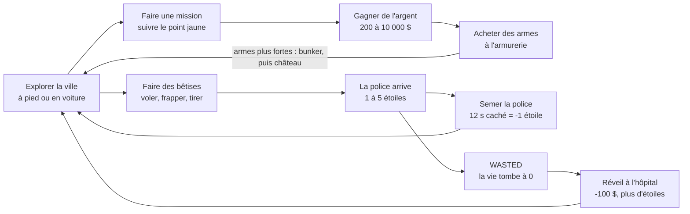

# GTAxel — Document de design

Mis à jour le 27 septembre 2026 (fusil de sniper à lunette, vendu à l'armurerie).

## Vision

GTAxel est un jeu d'action en 3D, en monde ouvert, qui se joue dans le navigateur. Il mélange GTA (ville libre, voitures, police) et Wolfenstein : on incarne B.J. Blazkowicz, qui chasse les nazis de la ville jusqu'au boss final, Hitler, dans le château Wolfenstein. Il a été imaginé par un garçon de 10 à 13 ans, qui doit pouvoir le modifier lui-même.

**Piliers de design**

- **Liberté** : dès le départ, on va où on veut, à pied ou en voiture volée. Les missions sont un fil conducteur, pas un couloir.
- **Pardonnant** : les ennemis visent mal, la vie remonte toute seule et la mort ne coûte que 100 $. On doit pouvoir faire des bêtises sans être puni trop vite.
- **Bidouillable** : tout tient dans un seul fichier `index.html`. Les réglages, les armes, la carte et les missions sont des tableaux commentés en français, en haut du fichier. On voit une modification en appuyant sur F5.
- **Zéro installation** : un double-clic ou un lien suffit, pourvu qu'on ait Internet. En ligne : [jlehen.github.io/GTAxel](https://jlehen.github.io/GTAxel/).

Pas de sang ni de gore : les personnages touchés tombent au sol. Pas de croix gammée non plus : les nazis se reconnaissent à leur uniforme, leur casque allemand et leur brassard rouge, et leurs bannières portent un W pour Wolfenstein.

## Boucle de jeu et contrôles

Le joueur alterne entre deux boucles. Les missions rapportent l'argent qui achète des armes ; les bêtises attirent la police jusqu'à ce qu'on la sème ou qu'on meure.



Une partie commence à pied, sans argent, avec les poings et un couteau. Le héros, B.J. Blazkowicz, a les cheveux blonds courts, un maillot blanc et un pantalon militaire. Il n'y a pas de fin : après la 6e mission, la ville reste libre.

### Contrôles

| Touche | À pied | En voiture |
| --- | --- | --- |
| Z Q S D ou flèches | Se déplacer | Accélérer, freiner, tourner |
| Souris | Regarder | Tourner la caméra autour de la voiture |
| Clic gauche | Tirer ou frapper | Rien |
| Clic droit | Viser (zoom, tir plus précis ; lunette avec le fusil de sniper) | Rien |
| Maj | Courir | Rien |
| Espace | Sauter (environ 1 m) | Frein à main, virage plus serré |
| Ctrl ou C | S'accroupir (bascule) | Rien |
| E ou F | Monter en voiture, acheter une arme | Descendre |
| V | 1re ou 3e personne | Vue intérieure ou extérieure |
| 1 à 8, molette | Changer d'arme | Rien |
| M | Ouvrir ou fermer la grande carte | Ouvrir ou fermer la grande carte |
| Entrée | Taper un code de triche | Taper un code de triche |
| Échap | Pause | Pause |

Les touches sont repérées par leur position : Z Q S D sur un clavier AZERTY, W A S D sur un QWERTY. Seule la touche M suit la lettre imprimée sur le clavier.

### Déplacements

| Allure | Vitesse |
| --- | --- |
| Course (Maj) | 8 m/s |
| Marche | 4 m/s |
| En visant | 2,4 m/s |
| Accroupi | 2 m/s |

### Caméras

- **3e personne (par défaut)** : caméra 3,8 m derrière l'épaule droite. En visant, elle se rapproche à 1,8 m et le champ de vision passe de 70° à 45°. Elle avance quand un mur la gêne.
- **1re personne (V)** : l'arme est dessinée par-dessus la scène, avec balancement et recul.
- **Lunette du fusil de sniper** : en visant, le champ de vision passe à 14° (70° divisé par le `zoom` de l'arme, qui vaut 5). L'écran devient noir autour d'un rond, avec deux traits noirs en croix. La souris est 5 fois plus douce, pour viser finement. L'arme en 1re personne n'est plus dessinée. En 3e personne, la caméra reste derrière l'épaule, et le noir cache B.J.
- **En voiture** : caméra 8 m derrière, qui recule avec la vitesse et se recale seule après 1,5 s sans bouger la souris.
- **Mort** : vue plongeante sur le corps pendant 3,5 s.

## Le monde

La ville mesure environ 900 m × 750 m : 120 pâtés de 60 m de côté, séparés par des rues de 14 m à double sens. Elle est construite au chargement à partir du tableau `CARTE`, et chaque pâté est identique d'une partie à l'autre.

La carte actuelle (tableau `CARTE` de `index.html`, 12 colonnes × 10 lignes) :

```
MMMMPPIIIMWM
MXMMPPIaTIMM
MMHIIITTTIIM
PPIIATTTTIIP
PPIIITTbTIIP
MIIcIITTIIMM
MMIIIIIIIPPM
MMPPIIIdBIMM
MMPPIIIIIPMM
MMMMMMPPPMMM
```

On y compte 13 pâtés de tours, 41 d'immeubles, 37 de maisons et 20 parcs. Les tours occupent le centre, les maisons et les parcs la bordure. Le bunker est en bas à droite de la carte et le château Wolfenstein en haut à droite, loin du départ en haut à gauche.

### Types de pâtés

| Lettre | Contenu |
| --- | --- |
| `T` | Une grande tour de 20 à 45 étages, ou 4 tours de 12 à 29 étages, en verre ou modernes |
| `I` | 2 ou 4 immeubles de 3 à 10 étages, en brique, béton ou modernes |
| `M` | 4 maisons avec pelouse et arbres, 1 voiture garée |
| `P` | Pelouse, allées pavées, fontaine, jusqu'à 14 arbres, 1 trousse de soin |
| `H` | Hôpital : point de réveil, 2 trousses de soin, 1 voiture garée |
| `A` | Armurerie : 5 stands d'armes devant la boutique, 1 gilet pare-balles |
| `B` | Bunker nazi : enceinte avec une seule entrée à l'ouest, sacs de sable, 8 soldats, le Kommandant, 2 trousses, 1 fusil d'assaut, 1 gilet |
| `W` | Château Wolfenstein : remparts crénelés de 7 m avec une grande porte au sud, 4 tours à toit pointu, un donjon de 16 m, bannières rouges, 8 soldats, Hitler, 2 trousses, 1 mitraillette, 1 gilet |
| `.` `X` `a`–`d` | Place pavée avec 4 arbres et 2 voitures garées |

Un étage fait 3 m. Les trousses de soin et les gilets pare-balles réapparaissent 60 s après avoir été ramassés.

### La rue

- Trottoirs de 20 cm, lampadaires tous les 18 m, passages piétons à chaque carrefour.
- Ciel réaliste avec des nuages qui avancent lentement, un soleil fixe et des ombres. Le brouillard commence à 120 m et cache tout au-delà de 650 m.
- Les vitres des immeubles reflètent le ciel ; les murs, les pavés et les tuiles ont du relief.
- Les arbres ont un feuillage fait de 5 boules de feuilles.
- Autour de la ville, une plaine d'herbe sans limite ni obstacle.

### La population

Seuls les environs du joueur sont vivants. Piétons et voitures apparaissent hors de sa vue et disparaissent quand il s'éloigne.

| | Piétons | Voitures en circulation |
| --- | --- | --- |
| Nombre | 30 | 16 |
| Apparaissent entre | 45 et 170 m | 60 et 230 m |
| Disparaissent au-delà de | 200 m | 280 m |
| Vitesse | 1,4 m/s | 11 m/s (40 km/h) |

- **Piétons** : ils vont de coin en coin sur les trottoirs et traversent aux passages piétons (30 % de chances à chaque coin). Ils s'enfuient pendant 8 s si on tire à moins de 40 m ou si on les frappe.
- **Voitures** : elles roulent sur la voie de droite et choisissent leur direction à chaque carrefour (60 % tout droit). Elles s'arrêtent devant un obstacle, et font demi-tour après 5 s bloquées.
- **Voitures garées** : 49 au départ, prêtes à être volées.

## Combat et armes

Il y a 8 armes, dont 2 au départ (poings et couteau). Le pistolet, la mitraillette, le fusil à pompe et le fusil d'assaut s'achètent à l'armurerie ou se ramassent sur les ennemis. Le fusil de sniper s'achète seulement à l'armurerie : aucun ennemi ne le lâche. Le bazooka ne s'achète pas : c'est Hitler qui le lâche. Un tir à la tête fait 2,5 fois plus de dégâts.

### Les armes

| Arme | Dégâts par coup | Coups par seconde | Portée | Prix | Munitions achetées | Particularité |
| --- | --- | --- | --- | --- | --- | --- |
| Poings | 15 | 2,2 | 2 m | départ | illimitées | Repousse la cible de 50 cm |
| Couteau | 50 | 2 | 2,3 m | départ | illimitées | Repousse la cible de 50 cm |
| Pistolet | 40 | 3,3 | 90 m | 200 $ | 36 | Un clic par tir |
| Mitraillette | 22 | 12,5 | 60 m | 800 $ | 150 | Automatique, peu précise |
| Fusil à pompe | 8 plombs × 20 | 1,1 | 30 m | 1 200 $ | 30 | Très dispersé |
| Fusil d'assaut | 34 | 8,3 | 130 m | 2 000 $ | 120 | Automatique, précis |
| Bazooka | 250 au centre | 0,67 | 150 m | lâché par Hitler | 10 roquettes | Explose dans un rayon de 6 m |
| Fusil de sniper | 150 | 0,67 | 250 m | 2 500 $ | 20 | Un clic par tir, lunette qui grossit 5 fois |

- Racheter une arme déjà possédée coûte moitié prix et ne donne que des munitions.
- Une arme ramassée donne la moitié des munitions ; si on l'a déjà, le quart.
- Les coups de poing et de couteau touchent l'ennemi le plus proche devant soi, jusqu'à 50° de côté.
- La dispersion est divisée par 2 en visant et doublée en courant.
- Renverser quelqu'un avec une voiture à plus de 14 km/h fait 200 dégâts.
- **Fusil de sniper** : une balle suffit pour un piéton, un policier ou un soldat. Il en faut 3 pour le Kommandant (2 à la tête) et 6 pour Hitler (3 à la tête). Dans la lunette, la balle s'écarte d'au plus 13 cm à 200 m ; sans viser, d'au plus 37 cm à 50 m. Un nazi touché de loin est alerté, mais il ne tire que s'il voit B.J. à moins de 45 m : on peut l'abattre sans risque, par l'entrée du bunker ou la porte du château.
- **Bazooka** : la roquette part du canon vers le viseur et vole tout droit à 20 m/s (`vitesseRoquette`), plus vite que B.J. qui court (8 m/s). Elle explose sur le premier mur ou voiture qu'elle touche, si elle passe à moins de 1 m du milieu du corps d'un personnage, par terre si on vise le sol, ou au bout de 150 m. Les dégâts baissent avec la distance à l'explosion, jusqu'à 0 à 6 m ; il n'y a pas de bonus à la tête. L'explosion blesse aussi B.J. s'il est trop près (jusqu'à 40 points s'il est collé) et fait exploser les voitures à moins de 6 m. Un personnage tué par une explosion compte comme s'il avait été abattu : un piéton ou un policier donne une étoile.

### Les personnages

| Type | Vie | Arme | Coups de pistolet pour tuer | Ce qu'il lâche |
| --- | --- | --- | --- | --- |
| Piéton | 50 | aucune | 2 | 10 à 69 $ (6 fois sur 10) |
| Policier | 70 | pistolet | 2 | Un pistolet |
| Soldat nazi | 90 | fusil d'assaut | 3 | Une mitraillette ou un fusil d'assaut |
| Kommandant | 450 | fusil à pompe | 12 (5 à la tête) | Un fusil à pompe et 1 000 $ |
| Hitler (boss final) | 900 | bazooka | 23 (9 à la tête) | Le bazooka et 2 000 $ |

Les corps disparaissent au bout de 15 s.

### Le joueur

- **Vie** : 100 points. Elle remonte de 8 points par seconde après 5 s sans être touché, soit de 0 à 100 en 12,5 s. Une trousse de soin rend 50 points.
- **Gilet pare-balles** : 100 points de protection (`giletMax`), qui prennent les dégâts à la place de la vie. Il ne se recharge pas tout seul : il faut ramasser un autre gilet. Il y en a 3 : à l'armurerie, dans le bunker (près de l'entrée) et dans le château (près de la porte). Quand B.J. en porte un, on le voit sur son torse, en bleu foncé.
- **Quand il est touché** : l'écran rougit sur les bords et un son grave retentit.

### Les ennemis

Un ennemi ne tire que s'il voit le joueur : ligne de vue dégagée, à moins de 70 m pour un policier et 45 m pour un soldat. Il tire toutes les 1 à 2 s, 0,6 à 1,2 s pour le Kommandant et 1,5 à 3 s pour Hitler. Il avance si le joueur est à plus de 22 m et recule s'il est à moins de 6 m.

| Ennemi | Dégâts par balle |
| --- | --- |
| Policier | 5 |
| Soldat | 7 |
| Kommandant | 12 |
| Hitler | 35 par roquette, au centre de l'explosion |

La chance de toucher vaut 35 % à courte distance et baisse avec l'éloignement : environ 25 % à 25 m et 7 % au-delà de 50 m. Elle est divisée par 2 si on est accroupi, et multipliée par 0,6 si on court. En voiture, elle est multipliée par 0,7 et on ne prend que 40 % des dégâts.

Hitler tire au bazooka. Sa roquette vole comme celle du joueur : il vise B.J. là où il est au moment du tir (il ne prévoit pas où il va). Elle explose si elle passe à moins de 1 m de lui, sur un mur ou une voiture, ou par terre. Elle laisse une traînée de fumée grise, qui aide à la voir venir. À 20 m, elle met 1 s à arriver : en courant sur le côté dès qu'on voit la flamme, on l'esquive. Une roquette ratée vise le sol à 3 à 6 m de B.J. et peut encore le blesser (rayon de 5 m). Elle explose aussi sur les soldats, policiers ou passants qui se trouvent sur son chemin, et les blesse comme le bazooka de B.J. (jusqu'à 250) : on peut se cacher derrière eux. Un piéton ou un policier tué par Hitler ne donne pas d'étoile à B.J. Hitler n'est jamais blessé par sa propre roquette. Elle fait exploser la voiture de B.J. s'il est dedans.

**Temps de survie estimé, sans bouger ni se soigner** :

| Situation | Temps moyen avant de mourir |
| --- | --- |
| 1 policier à 10 m | environ 85 s |
| Le Kommandant à 10 m | environ 20 s |
| Hitler à 10 m, sans bouger | environ 16 s |
| Les 8 soldats à 20 m qui voient le joueur | environ 10 s |

Avec un gilet pare-balles, ces temps doublent à peu près. Contre Hitler, on tient bien plus longtemps en esquivant ses roquettes. Ce sont des calculs à partir des réglages, pas des mesures en jeu.

Les nazis (soldats, Kommandant et Hitler) ne quittent jamais l'enceinte du bunker ou du château. Ils attaquent quand ils voient le joueur, ou quand il tire à moins de 50 m.

## Police et recherche

Le niveau de recherche va de 0 à 5 étoiles. Chaque bêtise ajoute une étoile ; 12 s sans être vu par la police en retirent une. À 0 étoile, les policiers sont pacifiques.

### Ce qui donne une étoile

- Tuer un piéton, à l'arme ou en l'écrasant.
- Tuer un policier.
- Frapper un policier, ou tirer à moins de 30 m de lui, quand on n'a encore aucune étoile.
- Voler une voiture de police, ou n'importe quelle voiture sous les yeux de la police.

### La réponse de la police

| Étoiles | Policiers à pied, au plus | Voitures de police en route, au plus | Temps minimum pour tout perdre |
| --- | --- | --- | --- |
| 1 | 2 | 0 | 12 s |
| 2 | 4 | 1 | 24 s |
| 3 | 6 | 2 | 36 s |
| 4 | 8 | 3 | 48 s |
| 5 | 8 | 3 | 60 s |

- **À pied** : un renfort apparaît toutes les 4 s, hors de vue, entre 45 et 170 m.
- **En voiture** : dès 2 étoiles, une voiture de police apparaît toutes les 6 s entre 90 et 230 m. Elle roule à 65 km/h et prend à chaque carrefour la rue qui la rapproche du joueur. À moins de 30 m, elle s'arrête et 2 policiers en descendent.
- **Être vu** : un policier vivant à moins de 50 m avec une ligne de vue dégagée, ou une voiture de police conduite à moins de 50 m. Les étoiles clignotent en bleu tant que la police voit le joueur.
- **Fin de poursuite** : à 0 étoile, les renforts à plus de 50 m disparaissent. Mourir remet aussi les étoiles à 0.

La sirène s'entend à moins de 180 m d'une voiture de police en route, et les policiers apparaissent en points rouges et bleus sur la mini-carte.

## Véhicules

Toutes les voitures se volent, garées ou en circulation, police comprise. Il suffit d'appuyer sur E à moins de 3,5 m. Si quelqu'un conduit, il est éjecté : un civil s'enfuit, un policier attaque.

### Conduite

| Caractéristique | Valeur |
| --- | --- |
| Vitesse maximale | 115 km/h (32 m/s) |
| Marche arrière | 36 km/h |
| 0 à 100 km/h | environ 2 s |
| Freinage | 2,5 fois plus fort que l'accélération |

- La direction ne répond pas à l'arrêt. Elle est la plus vive vers 20 km/h, puis deux fois moins à pleine vitesse.
- Le frein à main (Espace) freine fort et serre le virage.
- Contre un mur ou une autre voiture, au-dessus de 22 km/h, il y a un bruit de choc et la voiture perd 65 % de sa vitesse.
- En descendant, le joueur sort du côté qui n'est pas contre un mur. La voiture continue sur son élan puis s'arrête.

### Protection

En voiture, le joueur ne prend que 40 % des dégâts, et les ennemis le touchent 30 % moins souvent. En contrepartie, on ne peut pas tirer depuis une voiture.

### Explosions

Une voiture explose quand une roquette explose à côté d'elle (6 m pour celle du joueur, 5 m pour celle d'Hitler). Les balles ne lui font rien.

- L'explosion fait jusqu'à 150 dégâts aux personnages à moins de 7 m, et jusqu'à 40 à B.J. (`degatsExplosion`).
- Les voitures à moins de 7 m explosent à leur tour : on peut faire sauter toute une file.
- Si B.J. est dedans, il est éjecté avant l'explosion.
- Il reste une carcasse noire, qui brûle 12 s. On ne peut plus monter dedans. Elle disparaît au bout de 40 s, quand le joueur est à plus de 60 m.

### Ce que les voitures ne font pas (encore)

Les balles ne les abîment pas. Il n'y a qu'un seul modèle, en 10 couleurs, plus la version police avec gyrophares. Ce modèle a une carrosserie arrondie, un pare-brise et des vitres inclinés, des pare-chocs et des rétroviseurs.

## Missions et progression

Les 6 missions s'enchaînent dans l'ordre et rapportent 18 200 $ au total. Elles emmènent le joueur de la livraison d'un colis au combat final contre Hitler. L'argent gagné avant le bunker (3 000 $ une fois le pistolet payé) suffit pour s'offrir le fusil d'assaut ou le fusil de sniper, mais pas les deux.

| # | Mission | Étapes | Récompense |
| --- | --- | --- | --- |
| 1 | Le colis | Aller au point `a`, puis au point `b` en centre-ville | 500 $ |
| 2 | Armé jusqu'aux dents | Acheter un pistolet à l'armurerie | 200 $ |
| 3 | Voleur de voitures | Amener une voiture au garage `c` | 1 000 $ |
| 4 | Course-poursuite | Monter à 3 étoiles, puis semer la police | 1 500 $ |
| 5 | Opération bunker | Aller au point `d`, puis éliminer le Kommandant | 5 000 $ |
| 6 | Le château Wolfenstein | Éliminer Hitler dans le château | 10 000 $ |

Après la dernière mission, l'objectif affiche « Ville libre : fais ce que tu veux ! ».

### Types d'étapes

Une mission est une liste d'étapes. Chaque étape est validée dès que sa condition est vraie :

| Type | Condition |
| --- | --- |
| `aller` | Être à moins de 4 m du lieu |
| `voiture` | Être en voiture à moins de 7 m du lieu |
| `eliminer` | Plus aucun personnage de ce type en vie (`soldat`, `boss` ou `hitler`) |
| `etoiles` | Avoir au moins ce nombre d'étoiles |
| `semer` | Revenir à 0 étoile |
| `arme` | Posséder l'arme nommée |

### Guidage

- Un point jaune sur la mini-carte montre l'objectif. Il reste collé au bord quand l'objectif est loin.
- Dans le monde, une colonne jaune lumineuse de 5 m marque le lieu, ou une flèche jaune flotte au-dessus de la cible à éliminer.
- Le texte de l'étape s'affiche en bas de l'écran. À la fin, un bandeau annonce « MISSION RÉUSSIE » et la récompense.

### Argent

| Source | Montant |
| --- | --- |
| Missions | 200 à 10 000 $ |
| Hitler | 2 000 $ |
| Le Kommandant | 1 000 $ |
| Piétons tués | 10 à 69 $, 6 fois sur 10 |
| Mort | -100 $ |

### Mort

Quand la vie tombe à 0, l'écran passe en noir et blanc avec « WASTED » pendant 3,5 s. Le joueur se réveille devant l'hôpital avec toute sa vie, 100 $ de moins et 0 étoile. Il garde ses armes, ses munitions et sa progression dans les missions.

## Codes de triche

Les codes de triche changent seulement l'apparence de B.J. Entrée ouvre une case « Code : » ; on tape le code, puis Entrée. Pendant la saisie, les touches ne font plus bouger le joueur. Entrée ne fait rien quand la grande carte est ouverte. Un mauvais code affiche « Code inconnu ».

| Code | Effet |
| --- | --- |
| `SLIP` | En slip : jambes nues, slip blanc |
| `CHAUSSURE` | Perd la chaussure gauche (il reste la chaussette blanche) |
| `SOUTIF` | Torse et bras nus, soutien-gorge rose |
| `JAMBEDEBOIS` | Jambe droite en bois, sans chaussure |
| `BARCA` | Maillot du Barça à rayures bleues et grenat |
| `BEBE` | Deux fois plus petit, avec une grosse tête, tout nu avec une couche blanche |

Retaper un code annule son effet. Les effets se combinent : B.J. est remis dans sa tenue normale, puis chaque code actif est appliqué dans l'ordre du tableau. Ils durent même après une mort, mais pas après un rechargement de la page. Ils ne changent rien au jeu : la caméra reste à hauteur d'adulte pour le bébé, et l'arme vue en 1re personne ne change pas. Les codes sont dans le tableau `TRICHES`, en haut de `index.html`.

## Interface et son

L'écran reprend la disposition de GTA 5 : mini-carte ronde en bas à gauche, argent et étoiles en haut à droite. Tous les sons sont fabriqués par le programme ; il n'y a aucun fichier audio.

### Éléments à l'écran

| Emplacement | Élément | Détail |
| --- | --- | --- |
| Bas gauche | Mini-carte | Ronde, elle tourne avec la caméra. Elle dézoome en voiture. |
| Bas gauche | Barre de vie | Verte, rouge sous 30 points |
| Bas gauche | Barre du gilet | Bleue, sous la barre de vie, seulement quand on porte un gilet |
| Haut droite | Argent | En gros chiffres verts |
| Haut droite | Étoiles | 5 étoiles, qui clignotent en bleu quand la police voit le joueur |
| Haut droite | Arme et munitions | Nom de l'arme, nombre de balles ou de roquettes |
| Haut gauche | Aide | « Appuie sur E pour… » près d'une voiture ou d'un stand |
| Bas centre | Objectif | Texte de l'étape de mission en cours |
| Centre | Viseur | Un point blanc, avec une arme à feu, en visant ou en 1re personne. Caché dans la lunette |
| Plein écran | Lunette | Un rond avec deux traits en croix et du noir autour, en visant avec le fusil de sniper. Le reste de l'écran (mini-carte, argent) s'affiche par-dessus |
| Haut centre | Annonces | « MISSION RÉUSSIE », « +50 vie », « Gilet pare-balles ! », « Tu as semé la police ! » |
| Bas droite | Compteur | Vitesse en km/h, en voiture seulement |
| Plein écran | Bords rouges | Quand le joueur est touché |
| Plein écran | WASTED | Noir et blanc à la mort |
| Plein écran | Grande carte | Toute la ville, avec la touche M |
| Centre | Code de triche | « Code : … » pendant la saisie |

**La mini-carte** montre les bâtiments et les parcs, l'armurerie (A orange), l'hôpital (+ rouge), le château Wolfenstein (W rouge foncé) et le bunker (B noir). Les ennemis en alerte sont des points rouges ; les policiers et voitures de police clignotent en rouge et bleu. La flèche blanche du joueur est au centre.

**La grande carte** s'ouvre et se ferme avec la touche M. Elle couvre tout l'écran et met le jeu en pause : rien ne bouge tant qu'elle est ouverte.

- Le nord est en haut, comme dans le tableau `CARTE`. La carte ne tourne pas.
- À l'ouverture, on voit toute la ville. La molette zoome jusqu'à 6 pixels par mètre, et le zoom avant amène sur le joueur.
- La souris, les flèches ou Z Q S D déplacent la vue, sans sortir de la ville.
- Elle montre les mêmes choses que la mini-carte, avec en plus le nom des lieux : Armurerie, Hôpital, Château Wolfenstein, Bunker.
- La flèche blanche indique où regarde le joueur, ou dans quel sens roule sa voiture. L'objectif est un point jaune entouré d'un anneau qui bat, et son texte est rappelé en haut à gauche.
- Échap ferme la carte et affiche le menu de pause.

**Le menu** affiche le titre, une phrase d'histoire (« Tu es B.J. Blazkowicz… »), la liste des touches et « Clique pour jouer ». Échap libère la souris et ramène ce menu en mode pause.

### Sons

- **Armes** : chaque arme à feu a son propre coup de feu. Les tirs ennemis s'entendent moins fort de loin.
- **Explosions** : un gros boum grave, plus faible de loin.
- **Voiture** : moteur dont le son monte avec la vitesse, bruit de choc.
- **Police** : sirène à deux tons, plus forte quand la voiture approche.
- **Signaux** : bips pour un achat, un objet ramassé, une étape réussie, une blessure, la mort.

Polices de caractères : Anton pour les titres et les chiffres, Roboto Condensed pour le texte (Google Fonts).

## Architecture technique

Tout le jeu tient dans `index.html`, environ 1 760 lignes. Il n'y a ni installation, ni compilation, ni fichier image ou son. Le moteur 3D [Three.js](https://threejs.org) 0.186 est chargé depuis Internet (jsDelivr). Le site est publié par GitHub Pages depuis la branche `main`.

### Plan du fichier

| Lignes | Partie | Rôle |
| --- | --- | --- |
| 1–105 | HTML et CSS | Interface et menu |
| 107–228 | **Zones à modifier** | `REGLAGES`, `ARMES`, `CARTE`, `MISSIONS`, `TRICHES` |
| 229–316 | Outils, géographie, moteur 3D | Calculs, scène, lumières, ciel et nuages |
| 317–410 | Textures | Façades, vitres, routes, feuilles et pierres du château dessinées par le programme ; relief et reflets |
| 411–649 | Ville et collisions | Construction des pâtés (dont bunker et château), routes, arbres, murs invisibles |
| 650–823 | Personnages, voitures, sons | Modèles en formes simples arrondies, animations, sons synthétisés |
| 824–1297 | Joueur et PNJ | Tenues des personnages, objets, explosions, roquettes, clavier et souris, saisie des triches, tir, achat, conduite |
| 1298–1479 | Intelligence | Piétons, nazis, circulation, police |
| 1480–1546 | Missions, caméra | Enchaînement des étapes, vues, zoom de la lunette |
| 1547–1673 | Écran | Plan de la ville, mini-carte, grande carte, infos |
| 1674–1763 | Boucle principale | Mise à jour et affichage de chaque image |

### À chaque image

1. Déplacer le joueur, à pied ou en voiture, et tirer si le bouton est enfoncé.
2. Faire réfléchir et bouger chaque personnage, puis chaque voiture.
3. Ramasser les objets touchés par le joueur.
4. Gérer la police, repeupler autour du joueur, vérifier la mission.
5. Placer la caméra, mettre à jour l'écran, dessiner la scène.

Le pas de temps est limité à 50 ms, pour qu'un ralentissement ne fasse pas traverser les murs.

Quand la grande carte est ouverte, ces étapes sont sautées : seule la carte est dessinée.

### Choix techniques

- **Rendu** : ciel physique avec nuages, tone mapping ACES (exposition 0,5), ombres douces, reflets du ciel sur les vitres et la carrosserie, brouillard. Le soleil suit le joueur pour garder des ombres nettes autour de lui. Les éclairs de tir, les traits des balles, les flammes et les boules de feu sont dessinés à pleine lumière, sans passer par l'exposition (`toneMapped: false`).
- **Textures** : chaque texture est dessinée deux fois plus fin qu'avant, sur 512 points de côté pour la plupart. Le même dessin sert de relief : le clair ressort, le foncé se creuse. Chaque façade a un second dessin, invisible, qui dit où ça brille : les murs sont mats, les vitres sont des miroirs.
- **Performance** : les bâtiments sont fusionnés en un objet par matière, et les arbres et lampadaires sont dessinés en un seul lot. Résultat mesuré : 50 à 320 appels de dessin et environ 240 000 triangles par image, dont plus de la moitié pour les 327 arbres. Dessiner les ombres en demande autant de plus. Les personnages ne sont plus dessinés au-delà de 220 m, les voitures au-delà de 350 m.
- **Collisions** : chaque bâtiment est une boîte, rangée dans une grille de cases de 25 m. Joueur, piétons et voitures sont des cercles repoussés hors des boîtes. La même grille sert à savoir si un ennemi voit le joueur.
- **Tir** : un rayon part de la caméra à travers le viseur et s'arrête sur le premier bâtiment, personnage ou voiture. La roquette du bazooka, elle, est un vrai objet qui vole (`lancerRoquette`, `majRoquettes`) : à chaque image, elle avance, laisse une bouffée de fumée qui grossit et s'efface en 1,2 s, et un petit rayon de la longueur de son pas cherche un mur ou une voiture devant elle. Les personnages sont faits de pièces fines : pour eux, on regarde plutôt si la roquette passe à moins de 1 m du milieu de leur corps. Une explosion est une boule de feu qui grossit et s'efface en 0,6 s, avec une lumière orange.
- **Lunette** : seul le champ de vision de la caméra change. Le rond et la croix sont un dessin posé sur l'image (`#lunette`, en CSS), sans rien de plus à calculer. La dispersion d'un tir se compte en part de l'écran : zoomer 5 fois rend donc le tir 5 fois plus précis, sans règle spéciale.
- **Cartes** : une seule fonction dessine le plan de la ville. La mini-carte en garde une image toute faite ; la grande carte le redessine à chaque image, pour rester nette quel que soit le zoom.
- **Ville reproductible** : chaque pâté tire ses nombres au hasard à partir de sa position. La ville est donc la même à chaque partie.
- **Garde-fous pour le bidouilleur** : une alerte s'affiche si une ligne de `CARTE` n'a pas la bonne longueur, ou si une mission vise un lieu absent de la carte.
- **Tests** : `window.jeu` donne accès à l'état du jeu. Un script hors dépôt pilote Chromium sans écran pour vérifier circulation, tirs, police, missions et mort.

## Limites connues et pistes

Le jeu est complet et jouable, mais la fluidité sur une vraie carte graphique et le son n'ont pas encore été vérifiés : les tests ont tourné en rendu logiciel.

### Limites actuelles

- Il n'y a pas de sauvegarde : recharger la page fait tout recommencer.
- On ne peut entrer dans aucun bâtiment, et rien n'empêche de sortir de la ville dans la plaine.
- Le soleil est fixe : il n'y a ni nuit ni météo.
- Seules les explosions détruisent les voitures (pas les balles), on ne peut pas tirer depuis une voiture, et la police (65 km/h) ne rattrape pas une voiture lancée à fond (115 km/h).
- Les missions sont linéaires : une seule à la fois, dans l'ordre.
- Hitler ne meurt qu'une fois : le bazooka n'a que ses 10 roquettes, et on ne peut pas en racheter.
- Les roquettes volent tout droit : elles ne suivent pas leur cible.
- Le fusil de sniper porte à 250 m, mais les personnages ne sont plus dessinés au-delà de 220 m. Les murs du bunker et du château cachent leurs occupants : il faut viser par l'entrée.
- Il faut Internet, même pour jouer depuis le fichier.
- Ctrl+W ferme l'onglet dans certains navigateurs : C est plus sûr pour s'accroupir.

### Pistes pour la suite

- Voitures abîmées par les balles, tir par la fenêtre.
- Roquettes à acheter à l'armurerie.
- Sauvegarde de l'argent, des armes et des missions dans le navigateur.
- Cycle jour et nuit, avec les lampadaires allumés.
- Effets d'image (halo autour des lumières, coins assombris) : essayés puis retirés. En plein jour, le halo délave toute l'image et les coins assombris ne se voient presque pas, pour un coût élevé. À retenter avec la nuit.
- Missions au choix, avec des marqueurs sur la carte.
